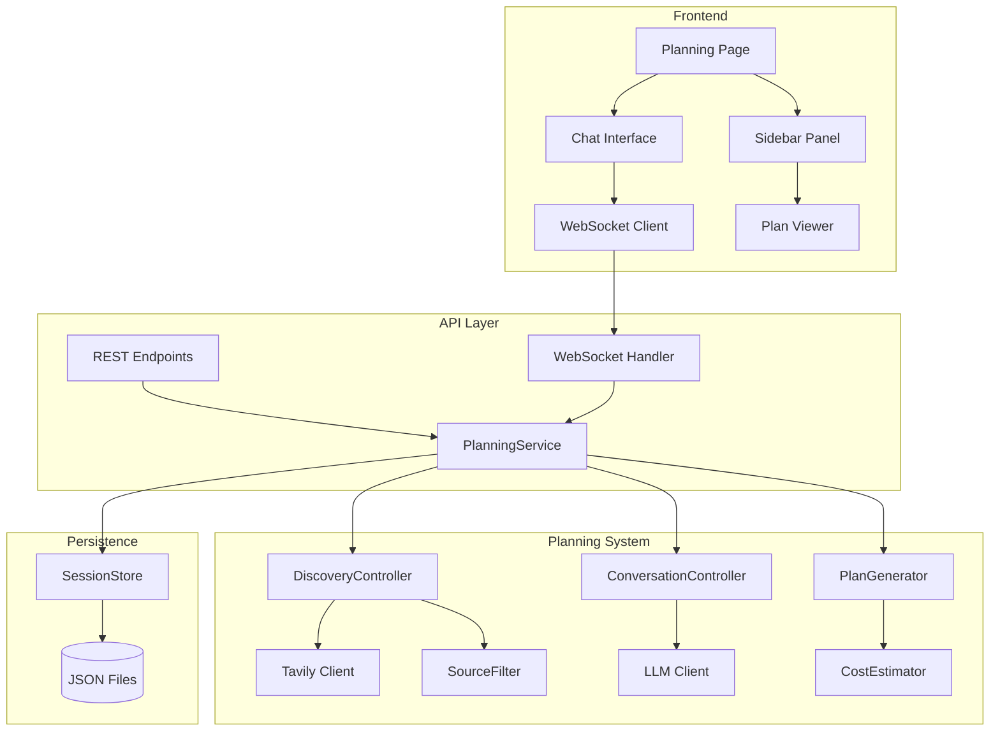

# Design Document: Conversational Planning

## Overview

This feature adds an interactive planning phase before expensive research runs. The system conducts discovery research, engages in conversation to understand user needs, proposes a structured research plan with cost estimates, and persists approved plans for execution.

The flow is: Topic → Discovery → Conversation → Plan Proposal → Approval → Hand-off to Run Orchestrator

## Architecture



## Components and Interfaces

### 1. PlanSession Model

```python
# backend/planning/models.py
from dataclasses import dataclass, field
from typing import List, Optional, Dict, Any
from datetime import datetime
from enum import Enum

class SessionStatus(Enum):
    DISCOVERY = "discovery"
    CONVERSING = "conversing"
    PLAN_PROPOSED = "plan_proposed"
    APPROVED = "approved"
    ABANDONED = "abandoned"

@dataclass
class Message:
    role: str  # "user" | "assistant" | "system"
    content: str
    timestamp: datetime
    sources: List[Dict[str, str]] = field(default_factory=list)

@dataclass
class ResearchComponent:
    name: str
    description: str
    research_questions: List[str]
    estimated_llm_calls: int
    estimated_cost_usd: float
    estimated_minutes: float

@dataclass
class ResearchPlan:
    components: List[ResearchComponent]
    total_estimated_cost: float
    total_estimated_minutes: float
    cost_tier: str  # "quick" | "standard" | "thorough"

@dataclass
class PlanSession:
    session_id: str
    topic: str
    status: SessionStatus
    messages: List[Message]
    discovered_sources: List[Dict[str, Any]]
    current_plan: Optional[ResearchPlan]
    created_at: datetime
    updated_at: datetime
    approved_at: Optional[datetime] = None
```

### 2. SourceFilter

```python
# backend/planning/source_filter.py
PRIORITY_DOMAINS = [
    "arxiv.org", "pubmed.ncbi.nlm.nih.gov", "scholar.google.com",
    "ieee.org", "acm.org", "nature.com", "science.org",
    "openai.com/research", "deepmind.com/research", "ai.meta.com"
]

EXCLUDED_DOMAINS = [
    "wikipedia.org", "britannica.com", "quora.com", "reddit.com",
    "medium.com", "dev.to", "stackoverflow.com"
]

class SourceFilter:
    def filter_sources(self, sources: List[Dict]) -> List[Dict]:
        """Filter and prioritize sources by domain."""
        filtered = [s for s in sources if not self._is_excluded(s["url"])]
        return sorted(filtered, key=lambda s: self._priority_score(s["url"]), reverse=True)
    
    def _is_excluded(self, url: str) -> bool:
        return any(domain in url for domain in EXCLUDED_DOMAINS)
    
    def _priority_score(self, url: str) -> int:
        for i, domain in enumerate(PRIORITY_DOMAINS):
            if domain in url:
                return len(PRIORITY_DOMAINS) - i
        return 0
```

### 3. CostEstimator

```python
# backend/planning/cost_estimator.py
from backend.config import MODEL_ROUTING

class CostEstimator:
    # Approximate costs per 1K tokens (input + output averaged)
    MODEL_COSTS = {
        "gpt-5.1": 0.03,
        "gemini-2.0-flash": 0.001,
    }
    
    # Estimated tokens per stage
    TOKENS_PER_STAGE = {
        "decomposition": 2000,
        "research_round": 4000,
        "debate": 3000,
        "review": 2500,
        "paper": 5000,
    }
    
    def estimate_component(self, component_name: str, cost_tier: str) -> Dict:
        """Estimate cost and time for a single component."""
        multipliers = {"quick": 0.5, "standard": 1.0, "thorough": 2.0}
        mult = multipliers.get(cost_tier, 1.0)
        
        total_tokens = sum(self.TOKENS_PER_STAGE.values()) * mult
        llm_calls = int(6 * mult)  # Base 6 calls per component
        
        # Use primary model cost
        primary_model = MODEL_ROUTING.get("primary", "gpt-5.1")
        cost_per_1k = self.MODEL_COSTS.get(primary_model, 0.03)
        
        return {
            "llm_calls": llm_calls,
            "cost_usd": round((total_tokens / 1000) * cost_per_1k, 2),
            "minutes": round(llm_calls * 0.5, 1)  # ~30 sec per call
        }
```

### 4. SessionStore

```python
# backend/planning/session_store.py
import json
from pathlib import Path
from typing import Optional, List
from datetime import datetime

class SessionStore:
    def __init__(self, base_dir: Path = Path("neura_lab_runs/plans")):
        self.base_dir = base_dir
        self.drafts_dir = base_dir / "drafts"
        self.base_dir.mkdir(parents=True, exist_ok=True)
        self.drafts_dir.mkdir(parents=True, exist_ok=True)
    
    def save(self, session: PlanSession) -> None:
        """Save session to appropriate location based on status."""
        if session.status == SessionStatus.APPROVED:
            path = self.base_dir / f"{session.session_id}.json"
        else:
            path = self.drafts_dir / f"{session.session_id}.json"
        
        path.write_text(json.dumps(self._serialize(session), indent=2))
    
    def load(self, session_id: str) -> Optional[PlanSession]:
        """Load session from either approved or drafts directory."""
        for dir in [self.base_dir, self.drafts_dir]:
            path = dir / f"{session_id}.json"
            if path.exists():
                return self._deserialize(json.loads(path.read_text()))
        return None
    
    def list_all(self) -> List[Dict]:
        """List all sessions (approved and drafts)."""
        sessions = []
        for path in self.base_dir.glob("*.json"):
            sessions.append({"id": path.stem, "status": "approved"})
        for path in self.drafts_dir.glob("*.json"):
            sessions.append({"id": path.stem, "status": "draft"})
        return sessions
    
    def _serialize(self, session: PlanSession) -> Dict:
        """Convert session to JSON-serializable dict."""
        # Implementation handles datetime conversion, enum values, etc.
        pass
    
    def _deserialize(self, data: Dict) -> PlanSession:
        """Restore session from dict."""
        # Implementation handles datetime parsing, enum restoration, etc.
        pass
```

### 5. API Endpoints

```python
# api/server.py additions

@app.post("/plan/start")
async def start_plan(request: StartPlanRequest):
    """Create new planning session and begin discovery."""
    session = planning_service.create_session(request.topic)
    # Discovery runs async, streams results via WebSocket
    asyncio.create_task(planning_service.run_discovery(session.session_id))
    return {"session_id": session.session_id}

@app.post("/plan/chat")
async def plan_chat(request: PlanChatRequest):
    """Process user message in planning conversation."""
    # Response streams via WebSocket
    asyncio.create_task(
        planning_service.process_message(request.session_id, request.message)
    )
    return {"status": "processing"}

@app.post("/plan/approve")
async def approve_plan(request: ApprovePlanRequest):
    """Lock and persist the plan."""
    result = planning_service.approve(request.session_id)
    return {
        "plan_id": result.session_id,
        "components": [c.name for c in result.current_plan.components]
    }

@app.get("/plan/{session_id}")
async def get_plan(session_id: str):
    """Get full session state."""
    session = planning_service.get_session(session_id)
    if not session:
        raise HTTPException(404, "Plan session not found")
    return session

@app.get("/plans")
async def list_plans():
    """List all plan sessions."""
    return planning_service.list_sessions()
```

## Data Models

### Session JSON Schema

```json
{
  "session_id": "2024-12-03_bci-gaming-research",
  "topic": "BCI gaming interfaces",
  "status": "approved",
  "messages": [
    {
      "role": "assistant",
      "content": "I've researched BCI gaming interfaces...",
      "timestamp": "2024-12-03T10:30:00Z",
      "sources": [{"url": "https://arxiv.org/...", "title": "..."}]
    }
  ],
  "discovered_sources": [...],
  "current_plan": {
    "components": [
      {
        "name": "Signal Processing",
        "description": "EEG signal acquisition and preprocessing",
        "research_questions": ["What sampling rates are optimal?"],
        "estimated_llm_calls": 6,
        "estimated_cost_usd": 1.50,
        "estimated_minutes": 3.0
      }
    ],
    "total_estimated_cost": 4.50,
    "total_estimated_minutes": 9.0,
    "cost_tier": "standard"
  },
  "created_at": "2024-12-03T10:00:00Z",
  "updated_at": "2024-12-03T10:45:00Z",
  "approved_at": "2024-12-03T10:45:00Z"
}
```

## Correctness Properties

*A property is a characteristic or behavior that should hold true across all valid executions of a system-essentially, a formal statement about what the system should do. Properties serve as the bridge between human-readable specifications and machine-verifiable correctness guarantees.*

### Property 1: Session serialization round-trip
*For any* valid PlanSession object, serializing to JSON and deserializing back SHALL produce an equivalent object with identical field values.
**Validates: Requirements 7.1, 7.2**

### Property 2: Source filtering correctness
*For any* list of source URLs, the SourceFilter SHALL exclude all URLs containing excluded domains AND prioritize URLs containing priority domains higher than unknown domains.
**Validates: Requirements 1.2, 1.3**

### Property 3: Discovery search count bounds
*For any* topic string, the discovery phase SHALL conduct between 3 and 13 Tavily searches inclusive.
**Validates: Requirements 1.1**

### Property 4: Plan component bounds
*For any* generated ResearchPlan, the number of components SHALL be between 2 and 10 inclusive.
**Validates: Requirements 3.1**

### Property 5: Plan contains required estimate fields
*For any* ResearchComponent in a plan, the component SHALL have positive values for estimated_llm_calls, estimated_cost_usd, and estimated_minutes.
**Validates: Requirements 3.3, 3.4, 3.5**

### Property 6: Conversation history preservation
*For any* PlanSession with N messages, after adding a new message, the session SHALL contain exactly N+1 messages with all previous messages unchanged.
**Validates: Requirements 2.4**

### Property 7: Approved plan immutability
*For any* PlanSession with status APPROVED, attempting to modify the current_plan SHALL raise an error or be rejected.
**Validates: Requirements 4.1**

### Property 8: Session ID uniqueness
*For any* two PlanSessions created from different topics or at different times, their session_ids SHALL be distinct.
**Validates: Requirements 4.1**

### Property 9: Serialization completeness
*For any* PlanSession, the serialized JSON SHALL contain all required fields: session_id, topic, messages, discovered_sources, current_plan, status, created_at, updated_at.
**Validates: Requirements 7.3**

### Property 10: Invalid JSON handling
*For any* malformed JSON string, deserialization SHALL raise a descriptive error without crashing the system.
**Validates: Requirements 7.4**

## Error Handling

| Error Scenario | Handling Strategy |
|----------------|-------------------|
| Tavily API failure | Retry with backoff, fall back to cached results if available |
| Invalid session_id | Return 404 with "Plan session not found" |
| LLM timeout during chat | Return partial response, allow retry |
| Malformed JSON in session file | Log error, return 500 with "Session corrupted" |
| WebSocket disconnect | Client auto-reconnects, resumes from last message |

## Testing Strategy

### Unit Tests
- SourceFilter: test priority scoring, exclusion logic
- CostEstimator: test estimates for each cost tier
- SessionStore: test save/load/list operations
- Serialization: test datetime handling, enum conversion

### Property-Based Tests (hypothesis)
- Session round-trip serialization
- Source filtering invariants
- Plan component bounds
- Message history preservation

### Integration Tests
- Full planning flow with mocked LLM/Tavily
- WebSocket streaming behavior
- API endpoint responses

