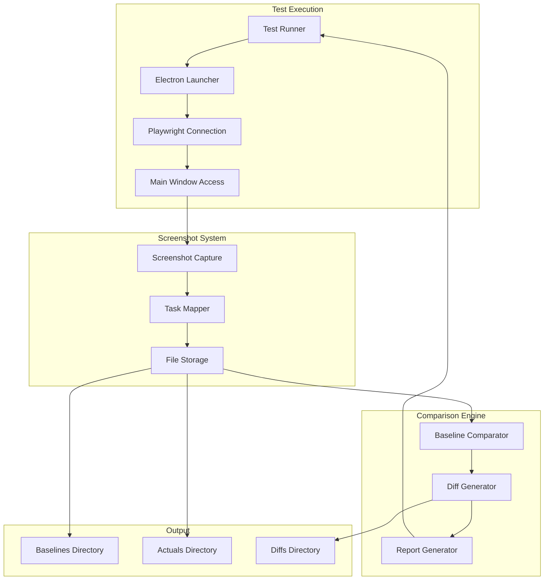

# Design Document: Electron Playwright Testing

## Overview

This feature implements an automated visual testing system using Playwright for the Electron desktop app. The system captures screenshots during test execution, maps them to specific spec tasks, compares against baselines, and provides actionable feedback when tests fail.

The key innovation is the task-mapping system that ties each screenshot to a specific task ID from the spec's tasks.md, enabling developers to validate implementations visually and trace failures back to requirements.

## Architecture



## Components and Interfaces

### 1. ElectronTestRunner

Main entry point for running visual tests.

```typescript
interface ElectronTestRunner {
  launch(): Promise<ElectronApp>;
  connect(): Promise<Page>;
  close(): Promise<void>;
}

interface TestConfig {
  electronPath: string;
  testMode: boolean;
  screenshotDir: string;
  baselineDir: string;
  diffDir: string;
  threshold: number; // 0-1, percentage difference allowed
}
```

### 2. VisualTest

Defines a visual test with task mapping.

```typescript
interface VisualTest {
  taskId: string;           // e.g., "3.1", "4.2"
  name: string;             // Descriptive test name
  page: PageName;           // Dashboard, Settings, etc.
  actions?: TestAction[];   // Optional interactions before capture
  waitFor?: string;         // CSS selector to wait for
}

type PageName = 'dashboard' | 'run' | 'results' | 'settings';

interface TestAction {
  type: 'click' | 'fill' | 'hover' | 'wait';
  selector?: string;
  value?: string;
  duration?: number;
}
```

### 3. ScreenshotManager

Handles screenshot capture and file management.

```typescript
interface ScreenshotManager {
  capture(page: Page, taskId: string, index?: number): Promise<string>;
  getBaseline(taskId: string, index?: number): string | null;
  saveAsBaseline(screenshotPath: string): Promise<void>;
  listScreenshots(taskId?: string): string[];
}

// Filename format: task-{taskId}-{index}-{timestamp}.png
// Example: task-3.1-1-20241202.png
```

### 4. BaselineComparator

Compares screenshots against baselines.

```typescript
interface ComparisonResult {
  match: boolean;
  diffPercentage: number;
  diffPath?: string;
  expectedPath: string;
  actualPath: string;
  taskId: string;
}

interface BaselineComparator {
  compare(actual: string, baseline: string): Promise<ComparisonResult>;
  generateDiff(actual: string, baseline: string): Promise<string>;
  isWithinThreshold(diffPercentage: number): boolean;
}
```

### 5. TestReporter

Generates test results with task context.

```typescript
interface TestResult {
  taskId: string;
  testName: string;
  status: 'passed' | 'failed' | 'new-baseline';
  screenshots: ScreenshotResult[];
  duration: number;
  error?: string;
}

interface ScreenshotResult {
  path: string;
  comparison?: ComparisonResult;
  isBaseline: boolean;
}

interface TestReporter {
  addResult(result: TestResult): void;
  generateReport(): TestReport;
  printSummary(): void;
}
```

## Data Models

### Directory Structure

```
frontend/
├── e2e/
│   ├── tests/
│   │   ├── dashboard.spec.ts
│   │   ├── settings.spec.ts
│   │   ├── run-orchestrator.spec.ts
│   │   └── results.spec.ts
│   ├── fixtures/
│   │   └── test-utils.ts
│   ├── screenshots/
│   │   ├── baselines/
│   │   │   ├── task-3.1-1.png
│   │   │   └── task-3.2-1.png
│   │   ├── actuals/
│   │   │   └── task-3.1-1-20241202.png
│   │   └── diffs/
│   │       └── task-3.1-1-diff.png
│   └── playwright.config.ts
```

### Test Definition Format

```typescript
// Example test file: dashboard.spec.ts
import { test, visualTest } from '../fixtures/test-utils';

test.describe('Dashboard - Task 3.1', () => {
  visualTest({
    taskId: '3.1',
    name: 'Dashboard displays connection status',
    page: 'dashboard',
    waitFor: '[data-testid="connection-status"]',
  });

  visualTest({
    taskId: '3.1',
    name: 'Dashboard shows stats cards',
    page: 'dashboard',
    waitFor: '[data-testid="stats-cards"]',
    index: 2, // Second screenshot for this task
  });
});
```

## Correctness Properties

*A property is a characteristic or behavior that should hold true across all valid executions of a system-essentially, a formal statement about what the system should do. Properties serve as the bridge between human-readable specifications and machine-verifiable correctness guarantees.*

### Property 1: Test runner launches Electron successfully
*For any* test invocation, the system should spawn an Electron process and return a valid window handle for testing.
**Validates: Requirements 1.1, 1.2**

### Property 2: Screenshots include task ID in filename
*For any* captured screenshot with a task ID, the resulting filename should contain that task ID in the format `task-{taskId}-{index}.png`.
**Validates: Requirements 2.2, 3.1, 3.2**

### Property 3: Multiple screenshots are numbered sequentially
*For any* task with multiple screenshots, the index numbers should be sequential starting from 1 (1, 2, 3, ...).
**Validates: Requirements 2.3, 3.4**

### Property 4: Screenshots stored in correct directory
*For any* captured screenshot, the file path should be within the configured screenshots directory.
**Validates: Requirements 2.4**

### Property 5: Baseline comparison detects differences
*For any* pair of screenshots with pixel differences above the threshold, the comparison should return `match: false` with the correct diff percentage.
**Validates: Requirements 4.1, 4.2**

### Property 6: Missing baseline creates new baseline
*For any* test run where no baseline exists, the captured screenshot should be saved as the new baseline.
**Validates: Requirements 4.3**

### Property 7: Failed tests include complete context
*For any* failed visual test, the result should contain: task ID, expected path, actual path, and diff percentage.
**Validates: Requirements 5.1, 5.2, 5.4**

### Property 8: Page filtering returns correct tests
*For any* page filter applied to the test runner, only tests for that specific page should execute.
**Validates: Requirements 6.1**

### Property 9: Interaction tests capture before/after
*For any* test with actions defined, the system should capture at least two screenshots (before and after the interaction).
**Validates: Requirements 6.4**

## Error Handling

| Error Scenario | Handling Strategy |
|----------------|-------------------|
| Electron fails to launch | Throw `ElectronLaunchError` with process stderr, retry once |
| Page navigation timeout | Throw `NavigationError` with URL and timeout duration |
| Screenshot capture fails | Retry once, then throw `ScreenshotError` with page state |
| Baseline not found | Create new baseline, mark test as `new-baseline` status |
| Comparison threshold exceeded | Mark test as failed, generate diff image |
| Invalid task ID format | Throw `ValidationError` with expected format |

## Testing Strategy

### Unit Tests
- Test filename generation with various task IDs
- Test threshold comparison logic
- Test sequential numbering for multiple screenshots
- Test page filter matching

### Property-Based Tests
Using `fast-check` for property-based testing:

1. **Filename format property**: For any valid task ID string, the generated filename should match the expected pattern
2. **Sequential numbering property**: For any number of screenshots N, indices should be 1 through N
3. **Threshold comparison property**: For any diff percentage and threshold, `isWithinThreshold` should return correct boolean
4. **Directory containment property**: For any screenshot path, it should be a child of the screenshots directory

### Integration Tests
- Full test run with Electron launch → screenshot → comparison → report
- Baseline creation flow
- Baseline update flow
- Multi-page test execution

### Test Configuration

```typescript
// playwright.config.ts
import { defineConfig } from '@playwright/test';

export default defineConfig({
  testDir: './e2e/tests',
  timeout: 30000,
  expect: {
    toHaveScreenshot: {
      maxDiffPixelRatio: 0.01, // 1% threshold
    },
  },
  use: {
    trace: 'on-first-retry',
  },
  projects: [
    {
      name: 'electron',
      use: {
        // Electron-specific config
      },
    },
  ],
});
```
