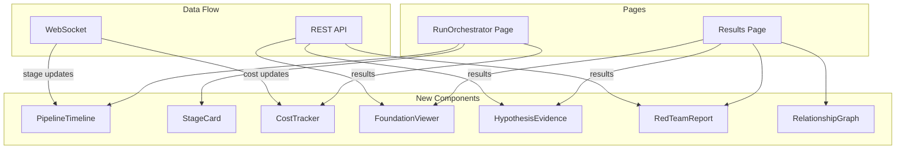

# Design Document: Frontend Pipeline Visualization

## Overview

This feature adds comprehensive visualization of the v2 research pipeline to the frontend. Users can see each stage's progress, view foundation knowledge, compare agent hypotheses and evidence, and review red team findings before accepting results.

## Architecture



## Components and Interfaces

### 1. PipelineTimeline

Shows all stages with current status.

```typescript
// frontend/src/components/PipelineTimeline.tsx

interface PipelineStage {
  name: string;
  displayName: string;
  status: 'pending' | 'running' | 'completed' | 'failed' | 'skipped';
  duration?: number;
  error?: string;
  skipReason?: string;
}

interface PipelineTimelineProps {
  stages: PipelineStage[];
  currentStage?: string;
}

const STAGE_GROUPS = [
  {
    name: 'Hierarchical Learning',
    stages: ['system_survey', 'relationship_mapping', 'constraint_propagation'],
  },
  {
    name: 'Foundation',
    stages: ['decomposer', 'foundation_learning', 'hypothesis_formation', 'evidence_gathering'],
  },
  {
    name: 'Research',
    stages: ['research_rounds', 'debate', 'reviewers'],
  },
  {
    name: 'Paper',
    stages: ['paper_v1', 'critics', 'paper_revision', 'verification'],
  },
  {
    name: 'Meta-Analysis',
    stages: ['meta_debate', 'meta_reviewers', 'paper_v2'],
  },
  {
    name: 'Validation',
    stages: ['red_team', 'final_arbiter'],
  },
];

export function PipelineTimeline({ stages, currentStage }: PipelineTimelineProps) {
  return (
    <div className="pipeline-timeline">
      {STAGE_GROUPS.map(group => (
        <div key={group.name} className="stage-group">
          <h4>{group.name}</h4>
          <div className="stages">
            {group.stages.map(stageName => {
              const stage = stages.find(s => s.name === stageName);
              return (
                <StageIndicator
                  key={stageName}
                  stage={stage}
                  isCurrent={stageName === currentStage}
                />
              );
            })}
          </div>
        </div>
      ))}
    </div>
  );
}
```

### 2. FoundationViewer

Displays foundation knowledge with tabs.

```typescript
// frontend/src/components/FoundationViewer.tsx

interface FoundationKnowledge {
  component: string;
  explainer: string;
  concepts: Array<{
    name: string;
    definition: string;
    relatedConcepts: string[];
  }>;
  verifiedClaims: Array<{
    statement: string;
    sourceUrl: string;
    confidence: number;
  }>;
  openDebates: Array<{
    topic: string;
    positionA: string;
    positionB: string;
  }>;
  openQuestions: Array<{
    question: string;
    confidence: number;
    whyUncertain: string;
  }>;
  confidenceScore: number;
}

interface FoundationViewerProps {
  foundation: FoundationKnowledge;
}

export function FoundationViewer({ foundation }: FoundationViewerProps) {
  const [activeTab, setActiveTab] = useState<'explainer' | 'concepts' | 'debates' | 'questions'>('explainer');
  
  return (
    <div className="foundation-viewer">
      <div className="header">
        <h3>Foundation Knowledge: {foundation.component}</h3>
        <ConfidenceBadge score={foundation.confidenceScore} />
      </div>
      
      <Tabs value={activeTab} onChange={setActiveTab}>
        <Tab value="explainer">Explainer</Tab>
        <Tab value="concepts">Concepts ({foundation.concepts.length})</Tab>
        <Tab value="debates">Open Debates ({foundation.openDebates.length})</Tab>
        <Tab value="questions">Open Questions ({foundation.openQuestions.length})</Tab>
      </Tabs>
      
      <div className="content">
        {activeTab === 'explainer' && (
          <MarkdownRenderer content={foundation.explainer} />
        )}
        {activeTab === 'concepts' && (
          <ConceptList concepts={foundation.concepts} />
        )}
        {activeTab === 'debates' && (
          <DebateList debates={foundation.openDebates} />
        )}
        {activeTab === 'questions' && (
          <QuestionList questions={foundation.openQuestions} />
        )}
      </div>
    </div>
  );
}
```

### 3. HypothesisEvidence

Side-by-side comparison of agent hypotheses and evidence.

```typescript
// frontend/src/components/HypothesisEvidence.tsx

interface Hypothesis {
  id: string;
  statement: string;
  angle: 'optimistic' | 'skeptical';
  confidence: number;
  researchQuestions: string[];
}

interface Evidence {
  url: string;
  title: string;
  content: string;
  supportsHypothesis?: string;
  isCounterEvidence: boolean;
  relevanceScore: number;
}

interface HypothesisEvidenceProps {
  hypothesesA: Hypothesis[];
  hypothesesB: Hypothesis[];
  evidenceA: Evidence[];
  evidenceB: Evidence[];
}

export function HypothesisEvidence({
  hypothesesA,
  hypothesesB,
  evidenceA,
  evidenceB,
}: HypothesisEvidenceProps) {
  return (
    <div className="hypothesis-evidence">
      <div className="agent-column agent-a">
        <h3>Agent A (Optimistic)</h3>
        <HypothesisList hypotheses={hypothesesA} />
        <EvidenceList evidence={evidenceA} />
      </div>
      
      <div className="agent-column agent-b">
        <h3>Agent B (Skeptical)</h3>
        <HypothesisList hypotheses={hypothesesB} />
        <EvidenceList evidence={evidenceB} />
      </div>
    </div>
  );
}
```

### 4. RedTeamReport

Displays red team findings with severity indicators.

```typescript
// frontend/src/components/RedTeamReport.tsx

interface RedTeamOutput {
  attackVectors: Array<{
    name: string;
    description: string;
    impact: 'high' | 'medium' | 'low';
  }>;
  failureModes: Array<{
    name: string;
    description: string;
    severity: 'critical' | 'major' | 'minor';
    mitigation: string;
  }>;
  overlookedRisks: Array<{
    name: string;
    description: string;
    likelihood: 'high' | 'medium' | 'low';
    impact: 'high' | 'medium' | 'low';
  }>;
  vulnerabilityScore: 'low' | 'medium' | 'high' | 'critical';
  recommendation: 'proceed' | 'proceed_with_caution' | 'needs_revision' | 'reject';
}

export function RedTeamReport({ report }: { report: RedTeamOutput }) {
  const criticalCount = report.failureModes.filter(f => f.severity === 'critical').length;
  
  return (
    <div className={`red-team-report ${report.recommendation}`}>
      <div className="header">
        <h3>🔴 Red Team Analysis</h3>
        <RecommendationBadge recommendation={report.recommendation} />
      </div>
      
      {criticalCount > 0 && (
        <Alert variant="destructive">
          {criticalCount} critical failure mode(s) identified
        </Alert>
      )}
      
      <Accordion>
        <AccordionItem title={`Attack Vectors (${report.attackVectors.length})`}>
          <AttackVectorList vectors={report.attackVectors} />
        </AccordionItem>
        
        <AccordionItem title={`Failure Modes (${report.failureModes.length})`}>
          <FailureModeList modes={report.failureModes} />
        </AccordionItem>
        
        <AccordionItem title={`Overlooked Risks (${report.overlookedRisks.length})`}>
          <RiskList risks={report.overlookedRisks} />
        </AccordionItem>
      </Accordion>
      
      <VulnerabilityScore score={report.vulnerabilityScore} />
    </div>
  );
}
```

### 5. RelationshipGraph

Visualizes component relationships.

```typescript
// frontend/src/components/RelationshipGraph.tsx

interface ComponentNode {
  id: string;
  name: string;
  depth: number;
}

interface ComponentEdge {
  source: string;
  target: string;
  type: 'feeds_into' | 'depends_on' | 'constrains';
  label?: string;
}

interface RelationshipGraphProps {
  nodes: ComponentNode[];
  edges: ComponentEdge[];
  budgets?: Record<string, { allocated: number; remaining: number }>;
}

export function RelationshipGraph({ nodes, edges, budgets }: RelationshipGraphProps) {
  // Use a simple SVG-based graph or integrate with a library like react-flow
  return (
    <div className="relationship-graph">
      <svg viewBox="0 0 800 400">
        {/* Render edges */}
        {edges.map(edge => (
          <EdgeLine key={`${edge.source}-${edge.target}`} edge={edge} nodes={nodes} />
        ))}
        
        {/* Render nodes */}
        {nodes.map(node => (
          <NodeCircle
            key={node.id}
            node={node}
            budget={budgets?.[node.name]}
          />
        ))}
      </svg>
      
      <Legend />
    </div>
  );
}
```

### 6. CostTracker

Shows real-time cost information.

```typescript
// frontend/src/components/CostTracker.tsx

interface CostInfo {
  estimated: number;
  actual: number;
  breakdown: {
    llmCalls: number;
    searches: number;
    llmCost: number;
    searchCost: number;
  };
  tier: 'quick' | 'standard' | 'thorough';
}

export function CostTracker({ cost }: { cost: CostInfo }) {
  const percentUsed = (cost.actual / cost.estimated) * 100;
  
  return (
    <div className="cost-tracker">
      <div className="cost-header">
        <span>Cost ({cost.tier})</span>
        <span>${cost.actual.toFixed(2)} / ${cost.estimated.toFixed(2)}</span>
      </div>
      
      <ProgressBar value={percentUsed} max={100} />
      
      <div className="breakdown">
        <div>LLM: ${cost.breakdown.llmCost.toFixed(2)} ({cost.breakdown.llmCalls} calls)</div>
        <div>Search: ${cost.breakdown.searchCost.toFixed(2)} ({cost.breakdown.searches} queries)</div>
      </div>
    </div>
  );
}
```

## API Updates

```typescript
// New API endpoints needed

// GET /api/run/:id/stages
interface StagesResponse {
  stages: PipelineStage[];
  currentStage: string;
}

// GET /api/run/:id/foundation/:component
interface FoundationResponse {
  foundation: FoundationKnowledge;
}

// GET /api/run/:id/hypotheses/:component
interface HypothesesResponse {
  hypothesesA: Hypothesis[];
  hypothesesB: Hypothesis[];
  evidenceA: Evidence[];
  evidenceB: Evidence[];
}

// GET /api/run/:id/red-team/:component
interface RedTeamResponse {
  report: RedTeamOutput;
}

// GET /api/run/:id/relationships
interface RelationshipsResponse {
  systemFoundation: SystemFoundation;
  relationshipMap: RelationshipMap;
}

// WebSocket events
interface StageUpdateEvent {
  type: 'stage_update';
  stage: string;
  status: string;
  duration?: number;
}

interface CostUpdateEvent {
  type: 'cost_update';
  cost: CostInfo;
}
```

## Correctness Properties

*A property is a characteristic or behavior that should hold true across all valid executions of a system.*

### Property 1: Stage status accuracy
*For any* stage update from the backend, the UI should reflect the correct status within 1 second.
**Validates: Requirements 1.2, 1.3**

### Property 2: Data display completeness
*For any* completed stage with output, the corresponding viewer should display all relevant fields.
**Validates: Requirements 2.1, 3.1, 4.1, 5.1**

## Testing Strategy

### Component Tests
- Test each viewer component with mock data
- Test status transitions in PipelineTimeline
- Test cost calculations in CostTracker

### Integration Tests
- Test WebSocket updates flow to UI
- Test API data loads into viewers
- Test full run visualization end-to-end
