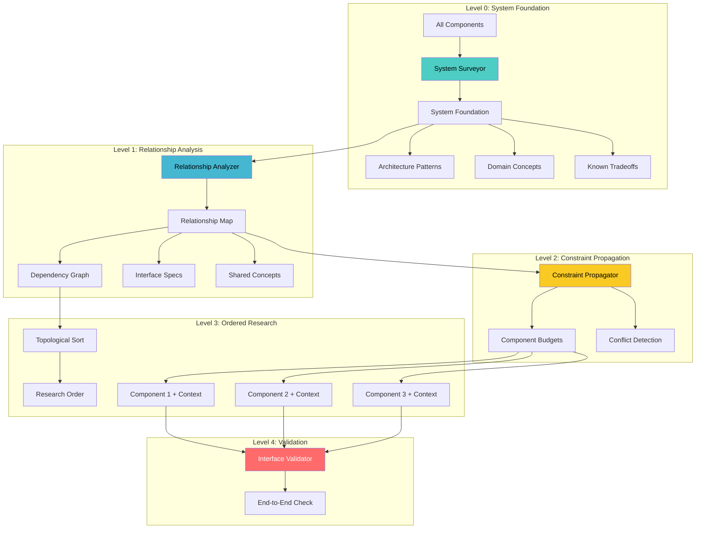

# Design Document: Hierarchical Learning

## Overview

Hierarchical Learning adds system-wide understanding before component-level research. The system first surveys the entire domain, maps relationships between components, propagates constraints, and then conducts context-aware research where each component knows its role in the larger system.

This prevents the current problem where components are researched in isolation and integration issues are only discovered at the end.

## Architecture



## Components and Interfaces

### 1. SystemSurveyor

Builds high-level understanding of the entire system.

```python
@dataclass
class ArchitecturePattern:
    name: str  # "real-time", "ML pipeline", "distributed"
    description: str
    implications: List[str]  # What this means for design

@dataclass
class DomainConcept:
    name: str
    definition: str
    relevant_components: List[str]
    
@dataclass
class KnownTradeoff:
    name: str  # "latency vs accuracy"
    description: str
    typical_resolution: str

@dataclass
class SystemFoundation:
    system_name: str
    domain: str
    components: List[str]
    architecture_patterns: List[ArchitecturePattern]
    domain_concepts: List[DomainConcept]
    known_tradeoffs: List[KnownTradeoff]
    industry_benchmarks: List[Dict[str, Any]]

class SystemSurveyor:
    def survey(
        self, 
        components: List[str], 
        project_context: str
    ) -> SystemFoundation:
        
        # Generate system-level queries
        queries = [
            f"{project_context} system architecture overview",
            f"{project_context} end-to-end pipeline design",
            f"{' AND '.join(components)} integration patterns",
            f"{project_context} industry benchmarks standards",
        ]
        
        # Search and synthesize
        results = search_academic(queries)
        
        # Extract via LLM
        return self._synthesize_foundation(results, components, project_context)
```

### 2. RelationshipAnalyzer

Maps how components connect and interact.

```python
@dataclass
class InterfaceSpec:
    data_format: str  # "numpy array", "JSON", "protobuf"
    data_shape: Optional[str]  # "[batch, channels, samples]"
    constraints: List[str]  # "latency < 10ms", "size < 1MB"
    protocol: Optional[str]  # "REST", "gRPC", "in-memory"

@dataclass
class ComponentRelationship:
    source: str
    target: str
    relationship_type: Literal["feeds_into", "depends_on", "constrains", "shares_resource"]
    interface: InterfaceSpec
    description: str

@dataclass
class RelationshipMap:
    components: List[str]
    relationships: List[ComponentRelationship]
    dependency_graph: Dict[str, List[str]]  # component -> [dependencies]
    reverse_graph: Dict[str, List[str]]  # component -> [dependents]
    shared_concepts: Dict[str, List[str]]  # concept -> [components]
    
    def topological_sort(self) -> List[List[str]]:
        """Return components in dependency order, grouped by level."""
        # Components with same level can be parallel
        pass

class RelationshipAnalyzer:
    def analyze(
        self, 
        components: List[str], 
        system_foundation: SystemFoundation
    ) -> RelationshipMap:
        
        prompt = f"""
Analyze relationships between these components: {components}

System context:
- Domain: {system_foundation.domain}
- Architecture: {system_foundation.architecture_patterns}
- Key concepts: {system_foundation.domain_concepts}

For each pair of related components, specify:
1. Relationship type (feeds_into, depends_on, constrains, shares_resource)
2. Interface specification (data format, constraints)
3. Description of the relationship

Output as JSON.
"""
        return call_llm_json(self.backend, RELATIONSHIP_SYSTEM_PROMPT, prompt)
```

### 3. ConstraintPropagator

Propagates constraints across the dependency graph.

```python
@dataclass
class ComponentBudget:
    component: str
    constraints: Dict[str, Any]  # "latency_ms": 15, "memory_mb": 100
    allocated_by: str  # Which upstream component or "system"
    remaining_downstream: Dict[str, Any]  # What's left for dependents

@dataclass
class ConstraintConflict:
    constraint_type: str  # "latency"
    total_required: float
    total_available: float
    components_involved: List[str]
    suggested_resolution: str

class ConstraintPropagator:
    def propagate(
        self, 
        relationship_map: RelationshipMap,
        system_constraints: Dict[str, Any]  # e.g., {"total_latency_ms": 50}
    ) -> Tuple[Dict[str, ComponentBudget], List[ConstraintConflict]]:
        
        budgets = {}
        conflicts = []
        
        # Process in topological order
        for level in relationship_map.topological_sort():
            for component in level:
                # Calculate budget from upstream + system constraints
                budget = self._calculate_budget(
                    component, 
                    relationship_map,
                    system_constraints,
                    budgets
                )
                
                # Check for conflicts
                conflict = self._check_conflicts(budget, system_constraints)
                if conflict:
                    conflicts.append(conflict)
                
                budgets[component] = budget
        
        return budgets, conflicts
```

### 4. ContextAwareResearchOrchestrator

Orchestrates research with full context.

```python
@dataclass
class ComponentContext:
    component: str
    system_foundation: SystemFoundation
    upstream_interfaces: List[InterfaceSpec]
    downstream_requirements: List[InterfaceSpec]
    allocated_budget: ComponentBudget
    upstream_findings: List[Dict[str, Any]]  # Results from dependencies
    shared_concepts: List[DomainConcept]

class ContextAwareResearchOrchestrator:
    def research_all(
        self,
        components: List[str],
        project_context: str
    ) -> Dict[str, Any]:
        
        # Level 0: System Foundation
        system_foundation = self.system_surveyor.survey(components, project_context)
        
        # Level 1: Relationship Mapping
        relationship_map = self.relationship_analyzer.analyze(
            components, system_foundation
        )
        
        # Level 2: Constraint Propagation
        budgets, conflicts = self.constraint_propagator.propagate(
            relationship_map,
            self._extract_system_constraints(project_context)
        )
        
        if conflicts:
            # Flag conflicts for user resolution
            self._report_conflicts(conflicts)
        
        # Level 3: Ordered Research
        results = {}
        for level in relationship_map.topological_sort():
            # Research components at same level in parallel
            level_results = self._research_level_parallel(
                level,
                system_foundation,
                relationship_map,
                budgets,
                results  # Pass upstream results
            )
            results.update(level_results)
        
        # Level 4: Validation
        validation = self.interface_validator.validate_all(
            results, relationship_map
        )
        
        return {
            "system_foundation": system_foundation,
            "relationship_map": relationship_map,
            "component_results": results,
            "validation": validation
        }
    
    def _build_component_context(
        self,
        component: str,
        system_foundation: SystemFoundation,
        relationship_map: RelationshipMap,
        budgets: Dict[str, ComponentBudget],
        upstream_results: Dict[str, Any]
    ) -> ComponentContext:
        
        # Get upstream interfaces (what this component receives)
        upstream_interfaces = [
            rel.interface 
            for rel in relationship_map.relationships
            if rel.target == component
        ]
        
        # Get downstream requirements (what this component must provide)
        downstream_requirements = [
            rel.interface
            for rel in relationship_map.relationships
            if rel.source == component
        ]
        
        # Get findings from upstream components
        upstream_findings = [
            upstream_results[rel.source]
            for rel in relationship_map.relationships
            if rel.target == component and rel.source in upstream_results
        ]
        
        return ComponentContext(
            component=component,
            system_foundation=system_foundation,
            upstream_interfaces=upstream_interfaces,
            downstream_requirements=downstream_requirements,
            allocated_budget=budgets.get(component),
            upstream_findings=upstream_findings,
            shared_concepts=[
                c for c in system_foundation.domain_concepts
                if component in c.relevant_components
            ]
        )
```

### 5. InterfaceValidator

Validates component outputs match interface specs.

```python
@dataclass
class ValidationResult:
    component: str
    interface_valid: bool
    mismatches: List[str]
    suggestions: List[str]

@dataclass
class EndToEndValidation:
    all_interfaces_valid: bool
    constraints_satisfied: bool
    violations: List[str]
    component_adjustments_needed: List[str]

class InterfaceValidator:
    def validate_component(
        self,
        component: str,
        research_output: Dict[str, Any],
        expected_interfaces: List[InterfaceSpec]
    ) -> ValidationResult:
        
        mismatches = []
        for interface in expected_interfaces:
            # Check if output matches expected format
            if not self._matches_format(research_output, interface):
                mismatches.append(f"Format mismatch: expected {interface.data_format}")
            
            # Check if constraints are satisfied
            for constraint in interface.constraints:
                if not self._satisfies_constraint(research_output, constraint):
                    mismatches.append(f"Constraint violated: {constraint}")
        
        return ValidationResult(
            component=component,
            interface_valid=len(mismatches) == 0,
            mismatches=mismatches,
            suggestions=self._generate_suggestions(mismatches)
        )
    
    def validate_end_to_end(
        self,
        all_results: Dict[str, Any],
        relationship_map: RelationshipMap,
        system_constraints: Dict[str, Any]
    ) -> EndToEndValidation:
        
        # Check all interfaces
        interface_results = [
            self.validate_component(comp, results, ...)
            for comp, results in all_results.items()
        ]
        
        # Check end-to-end constraints
        violations = self._check_system_constraints(
            all_results, system_constraints
        )
        
        # Identify which components need adjustment
        adjustments = self._identify_adjustments(violations, relationship_map)
        
        return EndToEndValidation(
            all_interfaces_valid=all(r.interface_valid for r in interface_results),
            constraints_satisfied=len(violations) == 0,
            violations=violations,
            component_adjustments_needed=adjustments
        )
```

## Data Models

### System Foundation Output

```json
{
  "system_name": "BCI Gaming System",
  "domain": "Brain-Computer Interface",
  "components": ["Signal Processing", "Neural Decoding", "Gaming UI"],
  "architecture_patterns": [
    {
      "name": "Real-time ML Pipeline",
      "description": "Continuous inference with strict latency requirements",
      "implications": ["Need streaming architecture", "Batch size = 1"]
    }
  ],
  "domain_concepts": [
    {
      "name": "Motor Imagery",
      "definition": "Mental rehearsal of movement",
      "relevant_components": ["Signal Processing", "Neural Decoding"]
    }
  ],
  "known_tradeoffs": [
    {
      "name": "Latency vs Accuracy",
      "description": "Longer windows improve accuracy but increase latency",
      "typical_resolution": "Adaptive window sizing"
    }
  ]
}
```

### Relationship Map Output

```json
{
  "components": ["Signal Processing", "Neural Decoding", "Gaming UI"],
  "relationships": [
    {
      "source": "Signal Processing",
      "target": "Neural Decoding",
      "relationship_type": "feeds_into",
      "interface": {
        "data_format": "numpy array",
        "data_shape": "[channels, samples]",
        "constraints": ["latency < 10ms", "sample_rate = 256Hz"],
        "protocol": "in-memory"
      },
      "description": "Filtered EEG signals for classification"
    }
  ],
  "dependency_graph": {
    "Signal Processing": [],
    "Neural Decoding": ["Signal Processing"],
    "Gaming UI": ["Neural Decoding"]
  },
  "shared_concepts": {
    "Motor Imagery": ["Signal Processing", "Neural Decoding"],
    "Latency Budget": ["Signal Processing", "Neural Decoding", "Gaming UI"]
  }
}
```

## Correctness Properties

*A property is a characteristic or behavior that should hold true across all valid executions of a system-essentially, a formal statement about what the system should do. Properties serve as the bridge between human-readable specifications and machine-verifiable correctness guarantees.*

### Property 1: System survey runs first
*For any* multi-component research run, the system survey should complete before any component foundation learning begins.
**Validates: Requirements 1.1**

### Property 2: System survey output structure
*For any* system survey output, it should contain: architecture_patterns (array), domain_concepts (array), and known_tradeoffs (array).
**Validates: Requirements 1.2, 1.3, 1.4**

### Property 3: Relationship analysis runs after survey
*For any* research run, relationship analysis should execute after system survey completes.
**Validates: Requirements 2.1**

### Property 4: Relationship map structure
*For any* relationship map, each relationship should have: source, target, relationship_type, and interface specification. Shared concepts should map to component lists.
**Validates: Requirements 2.2, 2.3, 2.4**

### Property 5: Constraint propagation
*For any* component with upstream constraints, those constraints should appear in the component's allocated_budget. Remaining budget should be calculated for downstream.
**Validates: Requirements 3.1, 3.2, 3.4**

### Property 6: Conflict detection
*For any* set of constraints that exceed available budget, a ConstraintConflict should be generated before research begins.
**Validates: Requirements 3.3**

### Property 7: Valid topological sort
*For any* dependency graph, the computed research order should be a valid topological sort (no component researched before its dependencies).
**Validates: Requirements 4.1, 4.3**

### Property 8: Parallel research for independent components
*For any* set of components with no dependencies between them, they should be researched in the same parallel batch.
**Validates: Requirements 4.2**

### Property 9: Upstream findings passed downstream
*For any* component with dependencies, its research context should include upstream_findings from completed dependencies.
**Validates: Requirements 4.4**

### Property 10: Component context completeness
*For any* component research, the context should include: system_foundation, upstream_interfaces, downstream_requirements, and allocated_budget.
**Validates: Requirements 5.1, 5.2, 5.3**

### Property 11: Interface validation
*For any* completed component research, interface validation should run and mismatches should be flagged.
**Validates: Requirements 6.1, 6.2**

### Property 12: End-to-end validation
*For any* completed research run, end-to-end constraint validation should run and violations should identify specific components.
**Validates: Requirements 6.3, 6.4**

## Error Handling

| Error Scenario | Handling Strategy |
|----------------|-------------------|
| System survey fails | Fall back to component-only research with warning |
| Circular dependency detected | Report error, ask user to clarify relationships |
| Constraint conflict unresolvable | Flag for user, suggest budget reallocation |
| Interface validation fails | Report mismatch, suggest which component to adjust |
| Upstream research fails | Skip dependent components, report partial results |

## Testing Strategy

### Unit Tests
- Test topological sort algorithm
- Test constraint propagation math
- Test interface validation logic
- Test context building

### Property-Based Tests
Using `hypothesis` for property-based testing:

1. **Topological sort property**: For any DAG, output order respects all edges
2. **Constraint propagation property**: Sum of allocated budgets ≤ total budget
3. **Context completeness property**: All required fields present in context

### Integration Tests
- Full hierarchical learning pipeline
- Multi-component research with dependencies
- Constraint conflict detection and reporting
- End-to-end validation flow
