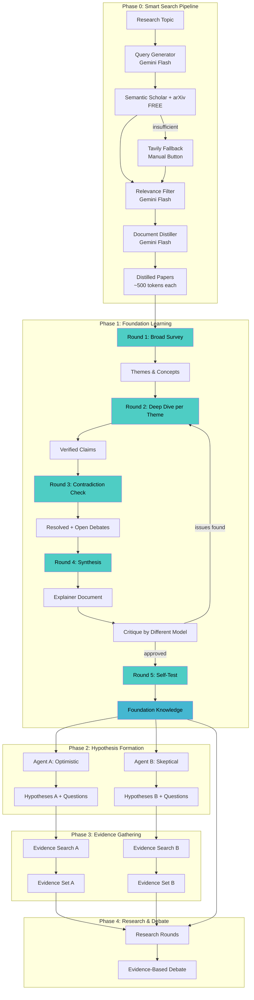

# Design Document: Intelligent Research System

## Overview

This system replaces the current simple search approach with a multi-round learning process that builds genuine understanding before agents form hypotheses. The key insight is that real learning requires iteration, verification, and self-testing - not just summarization.

The system is **mode-aware** - users choose their research goal upfront:
- **Learn** 📚 - Educational deep-dive with progressive explanations
- **Build** 🔧 - Implementation-focused with code, architecture, and dependencies
- **Compare** ⚖️ - Method comparison with benchmarks and decision matrices
- **Explore** 🔍 - Open-ended discovery with cross-domain connections

The system follows a "Learn → Hypothesize → Validate" pattern where:
1. Foundation Learning builds verified understanding of the topic
2. Agents form different hypotheses based on that foundation
3. Each agent gathers evidence for their own hypotheses
4. Debates are evidence-based with citations

## Architecture



## Components and Interfaces

### 0. SmartSearchPipeline

Handles query generation, bulk search, and relevance filtering using cheap LLMs.

```python
@dataclass
class SearchConfig:
    cheap_llm: str = "gemini-1.5-flash"  # For query gen and filtering
    queries_per_topic: int = 8
    results_per_query: int = 10
    relevance_threshold: int = 7  # 1-10 scale
    max_papers_to_return: int = 15

@dataclass
class ScoredPaper:
    paper_id: str
    title: str
    abstract: str
    url: str
    source: str  # "semantic_scholar" or "arxiv"
    relevance_score: int  # 1-10
    year: Optional[int]
    citation_count: Optional[int]

class SmartSearchPipeline:
    """Multi-stage search with cheap LLM filtering."""
    
    def __init__(self, config: SearchConfig):
        self.config = config
        self._query_cache: Dict[str, List[ScoredPaper]] = {}  # Cache by individual query
        self._topic_cache: Dict[str, List[ScoredPaper]] = {}  # Cache by topic (aggregated)
    
    def search(self, topic: str, use_tavily_fallback: bool = False) -> List[ScoredPaper]:
        """
        Search for papers on a topic.
        
        Args:
            topic: Research topic to search for
            use_tavily_fallback: If True, include Tavily web search (manual trigger)
        """
        topic_key = f"{topic}:{use_tavily_fallback}"
        if topic_key in self._topic_cache:
            return self._topic_cache[topic_key]
        
        # Step 1: Generate diverse queries (cheap LLM)
        queries = self._generate_diverse_queries(topic)
        
        # Step 2: Bulk search with incremental caching (free APIs first)
        candidates = self._bulk_search_with_cache(queries)
        
        # Step 2b: Tavily fallback if enabled and insufficient results
        if use_tavily_fallback and len(candidates) < 5:
            tavily_results = self._tavily_search(queries[:3])  # Limit Tavily queries
            candidates.extend(tavily_results)
        
        # Step 3: Batch score relevance (cheap LLM) - more efficient
        scored = self._batch_score_relevance(candidates, topic)
        
        # Step 4: Filter with adaptive threshold
        threshold = self._get_adaptive_threshold(len(scored))
        relevant = [p for p in scored if p.relevance_score >= threshold]
        result = sorted(relevant, key=lambda p: p.relevance_score, reverse=True)[:self.config.max_papers_to_return]
        
        self._topic_cache[topic_key] = result
        return result
    
    def _get_adaptive_threshold(self, result_count: int) -> float:
        """Adaptive threshold based on result count - lower for niche topics."""
        if result_count < 10:
            return 5.0  # Niche topic - be more lenient
        elif result_count < 30:
            return 6.0  # Moderate results
        else:
            return 7.0  # Many results - be selective
    
    def get_insufficient_results(self) -> bool:
        """Check if last search had insufficient results (for UI to show Tavily button)."""
        return len(self._cache.get(list(self._cache.keys())[-1], [])) < 5 if self._cache else True
    
    def _generate_diverse_queries(self, topic: str) -> List[str]:
        """Use cheap LLM to generate diverse search queries with diversity check."""
        prompt = f"""Generate {self.config.queries_per_topic} DIVERSE academic search queries for researching: {topic}

Include queries for:
- Survey/review papers
- Foundational methods
- Recent advances (2023-2024)
- Practical implementations
- Known challenges/limitations

IMPORTANT: Each query must be substantially different. Avoid similar phrasing.

Return as JSON: {{"queries": [...], "diversity_score": 0.0-1.0}}"""
        
        result = call_llm_json(self.config.cheap_llm, QUERY_GEN_SYSTEM, prompt)
        queries = result.get("queries", [])
        diversity = result.get("diversity_score", 0.5)
        
        # If diversity is too low, regenerate with explicit instruction
        if diversity < 0.6:
            prompt2 = f"""The previous queries were too similar. Generate {self.config.queries_per_topic} VERY DIFFERENT queries for: {topic}

Each query should target a completely different aspect:
1. Historical/foundational
2. State-of-the-art methods
3. Practical applications
4. Challenges and limitations
5. Future directions

Return as JSON array of strings."""
            queries = call_llm_json(self.config.cheap_llm, QUERY_GEN_SYSTEM, prompt2)
        
        return queries
    
    def _bulk_search_with_cache(self, queries: List[str]) -> List[ScoredPaper]:
        """Search with incremental caching - preserves results from previous queries."""
        candidates = []
        seen_ids = set()
        
        for query in queries:
            # Check query-level cache first
            if query in self._query_cache:
                for paper in self._query_cache[query]:
                    if paper.id not in seen_ids:
                        seen_ids.add(paper.id)
                        candidates.append(paper)
                continue
            
            # Search and cache this specific query
            query_results = []
            
            # Semantic Scholar
            for paper in semantic_scholar_search(query, limit=self.config.results_per_query):
                if paper.id not in seen_ids:
                    seen_ids.add(paper.id)
                    candidates.append(paper)
                    query_results.append(paper)
            
            # arXiv
            for paper in arxiv_search(query, limit=self.config.results_per_query // 2):
                if paper.id not in seen_ids:
                    seen_ids.add(paper.id)
                    candidates.append(paper)
                    query_results.append(paper)
            
            # Cache this query's results
            self._query_cache[query] = query_results
        
        return candidates
    
    def _batch_score_relevance(self, papers: List[ScoredPaper], topic: str) -> List[ScoredPaper]:
        """Multi-model consensus scoring with source reputation weighting."""
        if not papers:
            return papers
        
        # Step 1: Cluster papers to detect off-topic infiltration
        papers = self._cluster_and_flag_outliers(papers, topic)
        
        # Step 2: Multi-model consensus scoring
        papers = self._multi_model_consensus_score(papers, topic)
        
        # Step 3: Apply source reputation weighting
        papers = self._apply_reputation_weighting(papers)
        
        return papers
    
    def _multi_model_consensus_score(self, papers: List[ScoredPaper], topic: str) -> List[ScoredPaper]:
        """Score with multiple cheap models - require 2/3 consensus."""
        scoring_models = ["gemini-1.5-flash", "gpt-4o-mini", "claude-3-haiku"]
        
        batch_size = 10
        for i in range(0, len(papers), batch_size):
            batch = papers[i:i + batch_size]
            
            papers_text = "\n".join([
                f"{j+1}. {p.title}\n   Abstract: {p.abstract[:300]}"
                for j, p in enumerate(batch)
            ])
            
            prompt = f"""Topic: {topic}

Score each paper's relevance (1-10):
- 1-3: Not relevant
- 4-6: Somewhat relevant  
- 7-8: Relevant
- 9-10: Highly relevant

Papers:
{papers_text}

Return JSON array of scores in order: [score1, score2, ...]"""
            
            # Get scores from multiple models
            all_scores = []
            for model in scoring_models:
                try:
                    scores = call_llm_json(model, RELEVANCE_SYSTEM, prompt)
                    all_scores.append(scores)
                except:
                    continue  # Skip failed models
            
            # Consensus: require at least 2 models to agree
            for j, paper in enumerate(batch):
                paper_scores = [s[j] for s in all_scores if j < len(s)]
                
                if len(paper_scores) >= 2:
                    # Use median for consensus
                    paper_scores.sort()
                    median_score = paper_scores[len(paper_scores) // 2]
                    
                    # Check agreement: at least 2 models within 2 points of median
                    agreeing = sum(1 for s in paper_scores if abs(s - median_score) <= 2)
                    
                    if agreeing >= 2:
                        paper.relevance_score = median_score
                        paper.consensus_confidence = agreeing / len(paper_scores)
                    else:
                        # No consensus - flag for manual review or use conservative score
                        paper.relevance_score = min(paper_scores)  # Conservative
                        paper.consensus_confidence = 0.0
                        paper.flagged_for_review = True
                else:
                    paper.relevance_score = 5  # Default if not enough models
                    paper.consensus_confidence = 0.0
        
        return papers
    
    def _cluster_and_flag_outliers(self, papers: List[ScoredPaper], topic: str) -> List[ScoredPaper]:
        """Cluster papers by embedding similarity to detect off-topic infiltration."""
        from sklearn.cluster import KMeans
        from sentence_transformers import SentenceTransformer
        
        if len(papers) < 5:
            return papers  # Not enough for meaningful clustering
        
        # Get embeddings
        model = SentenceTransformer('all-MiniLM-L6-v2')
        texts = [f"{p.title}. {p.abstract[:500]}" for p in papers]
        embeddings = model.encode(texts)
        
        # Determine expected clusters (based on topic complexity)
        expected_clusters = min(max(len(papers) // 10, 2), 5)
        
        # Cluster
        kmeans = KMeans(n_clusters=expected_clusters, random_state=42)
        labels = kmeans.fit_predict(embeddings)
        
        # Get topic embedding for comparison
        topic_embedding = model.encode([topic])[0]
        
        # Check each cluster's relevance to topic
        cluster_relevance = {}
        for cluster_id in range(expected_clusters):
            cluster_center = kmeans.cluster_centers_[cluster_id]
            # Cosine similarity to topic
            similarity = np.dot(cluster_center, topic_embedding) / (
                np.linalg.norm(cluster_center) * np.linalg.norm(topic_embedding)
            )
            cluster_relevance[cluster_id] = similarity
        
        # Flag papers in low-relevance clusters
        relevance_threshold = 0.3  # Clusters below this are suspicious
        for i, paper in enumerate(papers):
            cluster_id = labels[i]
            paper.cluster_id = cluster_id
            paper.cluster_relevance = cluster_relevance[cluster_id]
            
            if cluster_relevance[cluster_id] < relevance_threshold:
                paper.flagged_off_topic = True
                paper.relevance_score = max(paper.relevance_score - 3, 1)  # Penalize
        
        return papers
    
    def _apply_reputation_weighting(self, papers: List[ScoredPaper]) -> List[ScoredPaper]:
        """Apply source reputation weighting to relevance scores."""
        # Reputation tiers
        HIGH_IMPACT_VENUES = {
            "nature", "science", "cell", "lancet", "nejm", "pnas",
            "neurips", "icml", "iclr", "cvpr", "acl", "emnlp",
            "ieee transactions", "acm computing surveys"
        }
        
        MEDIUM_IMPACT_VENUES = {
            "plos one", "scientific reports", "frontiers",
            "arxiv"  # arXiv is medium - not peer reviewed but often high quality
        }
        
        for paper in papers:
            venue_lower = (paper.venue or "").lower()
            
            # Citation-based boost
            citation_boost = 0
            if paper.citation_count:
                if paper.citation_count > 500:
                    citation_boost = 1.5
                elif paper.citation_count > 100:
                    citation_boost = 1.0
                elif paper.citation_count > 20:
                    citation_boost = 0.5
            
            # Venue-based boost
            venue_boost = 0
            if any(v in venue_lower for v in HIGH_IMPACT_VENUES):
                venue_boost = 1.0
            elif any(v in venue_lower for v in MEDIUM_IMPACT_VENUES):
                venue_boost = 0.3
            
            # Recency boost (newer papers slightly preferred for cutting-edge topics)
            recency_boost = 0
            if paper.year and paper.year >= 2023:
                recency_boost = 0.3
            elif paper.year and paper.year >= 2021:
                recency_boost = 0.1
            
            # Apply boosts (capped at +2 total)
            total_boost = min(citation_boost + venue_boost + recency_boost, 2.0)
            paper.reputation_boost = total_boost
            paper.relevance_score = min(paper.relevance_score + total_boost, 10)
        
        return papers
    
    def _tavily_search(self, queries: List[str]) -> List[ScoredPaper]:
        """Fallback to Tavily for web search (paid, manual trigger only)."""
        results = []
        seen_urls = set()
        
        for query in queries:
            try:
                tavily_results = tavily_search(query, max_results=5)
                for r in tavily_results:
                    if r["url"] not in seen_urls:
                        seen_urls.add(r["url"])
                        results.append(ScoredPaper(
                            paper_id=r["url"],
                            title=r["title"],
                            abstract=r["content"][:500],
                            url=r["url"],
                            source="tavily",
                            relevance_score=0,  # Will be scored later
                            year=None,
                            citation_count=None
                        ))
            except Exception as e:
                print(f"Tavily search failed: {e}")
        
        return results
```

### Model Routing for Cost Optimization

```python
MODEL_ROUTING = {
    # Cheap tasks (high volume, simple)
    "query_generator": "gemini-1.5-flash",
    "relevance_filter": "gemini-1.5-flash",
    "document_distiller": "gemini-1.5-flash",  # Compress docs before expensive analysis
    
    # Medium tasks (synthesis, extraction)
    "foundation_learner": "gemini-1.5-pro",
    "foundation_critic": "gpt-4o-mini",
    
    # Expensive tasks (deep analysis, reasoning)
    "agent_a": "gpt-5.1",
    "agent_b": "gemini-1.5-pro", 
    "debate": "gpt-5.1",
    "red_team": "gpt-5.1",
    "final_arbiter": "gpt-5.1",
}
```

### 0.5 DocumentDistiller

Compresses full documents into structured summaries before expensive analysis.

```python
@dataclass
class DistilledDocument:
    paper_id: str
    title: str
    original_tokens: int
    distilled_tokens: int
    key_claims: List[Dict[str, str]]  # {"claim": str, "quote": str}
    methods: List[str]
    results: List[Dict[str, Any]]  # {"metric": str, "value": str, "context": str}
    limitations: List[str]
    relevance_to_topic: str  # Brief explanation of why this paper matters

@dataclass
class DistillationStats:
    """Track compression efficiency for cost visibility."""
    total_original_tokens: int = 0
    total_distilled_tokens: int = 0
    documents_processed: int = 0
    documents_skipped: int = 0  # Short docs that passed through
    
    @property
    def compression_ratio(self) -> float:
        if self.total_original_tokens == 0:
            return 1.0
        return self.total_distilled_tokens / self.total_original_tokens
    
    @property
    def tokens_saved(self) -> int:
        return self.total_original_tokens - self.total_distilled_tokens

class DocumentDistiller:
    """Compress documents to essential concepts using cheap LLM."""
    
    def __init__(self, cheap_llm: str = "gemini-1.5-flash"):
        self.cheap_llm = cheap_llm
        self.skip_threshold = 1000   # Don't distill short docs
        self.chunk_threshold = 10000  # Use chunked distillation for long docs
        self._cache: Dict[str, DistilledDocument] = {}  # Cache by paper_id + topic
        self.stats = DistillationStats()
    
    def distill(self, paper: ScoredPaper, topic: str) -> DistilledDocument:
        """Distill a single paper, with caching and quality validation."""
        cache_key = f"{paper.paper_id}:{hash(topic)}"
        if cache_key in self._cache:
            return self._cache[cache_key]
        
        # Get content (may need to fetch full text)
        content = getattr(paper, 'content', paper.abstract)
        original_tokens = len(content.split())
        
        # Skip if already short
        if original_tokens < self.skip_threshold:
            result = self._passthrough(paper, content)
            self.stats.documents_skipped += 1
        # Use chunked distillation for very long papers
        elif original_tokens > self.chunk_threshold:
            result = self._chunked_distill(paper, content, topic)
            self.stats.documents_processed += 1
        else:
            result = self._do_distill(paper, content, topic)
            self.stats.documents_processed += 1
        
        # Validate distillation quality
        result = self._validate_and_fix(result, paper, content, topic)
        
        # Calculate information density score
        result.information_density = self._calculate_density(result)
        
        # Update stats
        self.stats.total_original_tokens += result.original_tokens
        self.stats.total_distilled_tokens += result.distilled_tokens
        
        self._cache[cache_key] = result
        return result
    
    def _validate_and_fix(self, result: DistilledDocument, paper: ScoredPaper, 
                          content: str, topic: str) -> DistilledDocument:
        """Validate distillation quality and re-distill if needed."""
        # Check if key claims have supporting quotes
        empty_quotes = sum(1 for claim in result.key_claims if not claim.get('quote', '').strip())
        
        if empty_quotes > len(result.key_claims) / 2:  # More than half missing quotes
            # Re-distill with explicit quote extraction
            result = self._do_distill_with_quotes(paper, content, topic)
        
        return result
    
    def _do_distill_with_quotes(self, paper: ScoredPaper, content: str, topic: str) -> DistilledDocument:
        """Re-distill with explicit instruction to extract quotes."""
        prompt = f"""Distill this paper for research on: {topic}

Paper: {paper.title}
Content: {content[:15000]}

CRITICAL: For EVERY key claim, you MUST include an exact quote from the paper.
If you cannot find a supporting quote, do not include that claim.

Extract and return as JSON:
{{
  "key_claims": [
    {{"claim": "main finding", "quote": "EXACT quote from paper - REQUIRED"}}
  ],
  "methods": ["technique with description"],
  "results": [{{"metric": "what", "value": "result", "context": "conditions"}}],
  "limitations": ["limitation"],
  "relevance_to_topic": "why this matters"
}}"""
        
        result = call_llm_json(self.cheap_llm, DISTILLER_SYSTEM, prompt)
        return self._build_distilled_doc(paper, content, result)
    
    def _chunked_distill(self, paper: ScoredPaper, content: str, topic: str) -> DistilledDocument:
        """Distill very long papers by section, then merge."""
        sections = self._split_into_sections(content)
        
        section_summaries = {}
        for section_name, section_content in sections.items():
            if len(section_content.split()) > 100:  # Only process substantial sections
                prompt = f"""Summarize the {section_name} section for research on: {topic}

Content: {section_content[:5000]}

Extract key points as JSON:
{{
  "key_points": ["point 1", "point 2"],
  "quotes": ["relevant quote 1"],
  "data": ["any numbers or metrics"]
}}"""
                section_summaries[section_name] = call_llm_json(self.cheap_llm, DISTILLER_SYSTEM, prompt)
        
        # Merge section summaries
        return self._merge_section_summaries(paper, content, section_summaries, topic)
    
    def _split_into_sections(self, content: str) -> Dict[str, str]:
        """Split paper into standard academic sections."""
        sections = {
            "introduction": "",
            "methods": "",
            "results": "",
            "discussion": "",
            "conclusion": ""
        }
        
        # Simple heuristic splitting (can be improved with LLM)
        content_lower = content.lower()
        section_markers = [
            ("introduction", ["introduction", "background", "1."]),
            ("methods", ["method", "approach", "2.", "materials"]),
            ("results", ["result", "experiment", "3.", "evaluation"]),
            ("discussion", ["discussion", "4.", "analysis"]),
            ("conclusion", ["conclusion", "5.", "summary", "future work"])
        ]
        
        # Find section boundaries and extract content
        # (Simplified - production would use more sophisticated parsing)
        current_section = "introduction"
        for line in content.split('\n'):
            line_lower = line.lower().strip()
            for section_name, markers in section_markers:
                if any(marker in line_lower for marker in markers):
                    current_section = section_name
                    break
            sections[current_section] += line + "\n"
        
        return sections
    
    def _merge_section_summaries(self, paper: ScoredPaper, content: str, 
                                  summaries: Dict[str, Dict], topic: str) -> DistilledDocument:
        """Merge section summaries into unified distillation."""
        all_claims = []
        all_methods = []
        all_results = []
        all_quotes = []
        
        for section, summary in summaries.items():
            all_claims.extend([{"claim": p, "quote": "", "section": section} 
                              for p in summary.get("key_points", [])])
            all_quotes.extend(summary.get("quotes", []))
            if section == "methods":
                all_methods.extend(summary.get("key_points", []))
            if section == "results":
                all_results.extend([{"metric": d, "value": "", "context": ""} 
                                   for d in summary.get("data", [])])
        
        # Match quotes to claims
        for claim in all_claims:
            for quote in all_quotes:
                if any(word in quote.lower() for word in claim["claim"].lower().split()[:3]):
                    claim["quote"] = quote
                    break
        
        return DistilledDocument(
            paper_id=paper.paper_id,
            title=paper.title,
            original_tokens=len(content.split()),
            distilled_tokens=sum(len(str(s).split()) for s in summaries.values()),
            key_claims=all_claims,
            methods=all_methods,
            results=all_results,
            limitations=[],
            relevance_to_topic=f"Chunked distillation for {topic}"
        )
    
    def _calculate_density(self, doc: DistilledDocument) -> float:
        """Calculate information density score (0.0-1.0)."""
        score = 0.0
        
        # Claims with quotes are high value
        claims_with_quotes = sum(1 for c in doc.key_claims if c.get('quote', '').strip())
        score += min(claims_with_quotes * 0.15, 0.3)  # Up to 0.3 for claims
        
        # Quantitative results are high value
        results_with_values = sum(1 for r in doc.results if r.get('value', '').strip())
        score += min(results_with_values * 0.1, 0.3)  # Up to 0.3 for results
        
        # Methods indicate actionable content
        score += min(len(doc.methods) * 0.05, 0.2)  # Up to 0.2 for methods
        
        # Limitations show thorough analysis
        score += min(len(doc.limitations) * 0.05, 0.1)  # Up to 0.1 for limitations
        
        # Compression ratio bonus (more compression = denser original)
        if doc.original_tokens > 0:
            compression = 1 - (doc.distilled_tokens / doc.original_tokens)
            score += compression * 0.1  # Up to 0.1 for compression
        
        return min(score, 1.0)
    
    def _do_distill(self, paper: ScoredPaper, content: str, topic: str) -> DistilledDocument:
        """Actually perform distillation via LLM."""
        prompt = f"""Distill this paper for research on: {topic}

Paper: {paper.title}
Content: {content[:15000]}

Extract and return as JSON:
{{
  "key_claims": [
    {{"claim": "main finding or assertion", "quote": "exact supporting quote from paper"}}
  ],
  "methods": ["technique 1 with brief description", "technique 2"],
  "results": [
    {{"metric": "what was measured", "value": "the result", "context": "conditions/dataset"}}
  ],
  "limitations": ["stated limitation 1", "limitation 2"],
  "relevance_to_topic": "One sentence on why this paper matters for {topic}"
}}

IMPORTANT: 
- Keep total output under 500 tokens
- Only include information DIRECTLY relevant to: {topic}
- Include exact quotes for key claims when possible
- Prioritize quantitative results over qualitative statements"""
        
        try:
            result = call_llm_json(self.cheap_llm, DISTILLER_SYSTEM, prompt)
            distilled_tokens = len(str(result).split())
            
            # Validate structure
            result.setdefault("key_claims", [])
            result.setdefault("methods", [])
            result.setdefault("results", [])
            result.setdefault("limitations", [])
            result.setdefault("relevance_to_topic", "")
            
            return DistilledDocument(
                paper_id=paper.paper_id,
                title=paper.title,
                original_tokens=len(content.split()),
                distilled_tokens=distilled_tokens,
                **result
            )
        except Exception as e:
            # Fallback: return abstract as minimal distillation
            return self._passthrough(paper, content, error=str(e))
    
    def distill_batch(self, papers: List[ScoredPaper], topic: str) -> List[DistilledDocument]:
        """Distill multiple papers (uses cache, can parallelize)."""
        from concurrent.futures import ThreadPoolExecutor
        
        with ThreadPoolExecutor(max_workers=4) as executor:
            results = list(executor.map(lambda p: self.distill(p, topic), papers))
        
        return results
    
    def _passthrough(self, paper: ScoredPaper, content: str, error: str = None) -> DistilledDocument:
        """For short docs or errors, structure the content minimally."""
        return DistilledDocument(
            paper_id=paper.paper_id,
            title=paper.title,
            original_tokens=len(content.split()),
            distilled_tokens=len(content.split()),
            key_claims=[{"claim": paper.abstract[:500], "quote": ""}],
            methods=[],
            results=[],
            limitations=[f"Distillation error: {error}"] if error else [],
            relevance_to_topic="Passthrough - document below threshold or distillation failed"
        )
    
    def get_stats(self) -> Dict[str, Any]:
        """Get compression statistics for cost tracking."""
        return {
            "documents_processed": self.stats.documents_processed,
            "documents_skipped": self.stats.documents_skipped,
            "total_original_tokens": self.stats.total_original_tokens,
            "total_distilled_tokens": self.stats.total_distilled_tokens,
            "compression_ratio": f"{self.stats.compression_ratio:.1%}",
            "tokens_saved": self.stats.tokens_saved,
            "estimated_cost_saved": f"${self.stats.tokens_saved * 0.00003:.4f}"  # Rough GPT-4 pricing
        }
```

### 0.6 MultimodalDistiller

Extracts and understands figures, equations, and tables from PDFs using vision models.

```python
@dataclass
class ExtractedFigure:
    figure_id: str  # "Fig 1", "Table 2", etc.
    image_data: bytes  # PNG/JPEG bytes
    caption: str
    description: str  # Vision model description
    key_data: List[Dict[str, Any]]  # Extracted numbers, relationships
    figure_type: str  # "chart", "diagram", "table", "equation"

@dataclass
class ExtractedEquation:
    equation_id: str
    latex: str  # LaTeX representation
    plain_english: str  # Human-readable explanation
    variables: Dict[str, str]  # Variable definitions

@dataclass
class Discrepancy:
    claim_source: str  # "text", "abstract"
    claim_value: str
    figure_source: str  # "Fig 3", "Table 1"
    figure_value: str
    resolution: str  # Which value was used
    trust_reason: str  # Why that source was trusted

@dataclass 
class MultimodalDocument:
    paper_id: str
    title: str
    authors: List[str]
    year: int
    source_url: str
    # Text distillation
    text_summary: str
    key_claims: List[Dict[str, str]]
    # Visual elements
    figures: List[ExtractedFigure]
    equations: List[ExtractedEquation]
    # Quality tracking
    discrepancies: List[Discrepancy]
    confidence_score: float

# Source hierarchy for conflict resolution
SOURCE_TRUST_ORDER = [
    "figure",      # Highest trust - visual ground truth
    "table",       # High trust - structured data
    "equation",    # High trust - mathematical ground truth
    "abstract",    # Medium trust - usually accurate
    "body_text",   # Lower trust - can be imprecise
]

class MultimodalDistiller:
    """Extract and understand figures, equations, and tables from PDFs."""
    
    def __init__(self, vision_model: str = "gemini-1.5-flash"):
        self.vision_model = vision_model
        self.pdf_parser = PDFParser()
    
    def distill(self, pdf_url: str, topic: str) -> MultimodalDocument:
        """Full multimodal distillation of a PDF."""
        # Step 1: Parse PDF
        parsed = self.pdf_parser.parse(pdf_url)
        
        # Step 2: Extract and describe figures
        figures = self._process_figures(parsed.figures, topic)
        
        # Step 3: Extract and explain equations
        equations = self._process_equations(parsed.equations)
        
        # Step 4: Distill text
        text_distilled = self._distill_text(parsed.text, topic)
        
        # Step 5: Cross-validate and resolve discrepancies
        discrepancies = self._find_discrepancies(
            text_distilled, figures, equations
        )
        
        return MultimodalDocument(
            paper_id=parsed.paper_id,
            title=parsed.title,
            authors=parsed.authors,
            year=parsed.year,
            source_url=pdf_url,
            text_summary=text_distilled["summary"],
            key_claims=text_distilled["claims"],
            figures=figures,
            equations=equations,
            discrepancies=discrepancies,
            confidence_score=self._calculate_confidence(discrepancies)
        )
    
    def _process_figures(self, raw_figures: List, topic: str) -> List[ExtractedFigure]:
        """Use vision model to understand each figure."""
        figures = []
        for fig in raw_figures:
            prompt = f"""Analyze this figure for research on: {topic}

Caption: {fig.caption}

Describe:
1. What type of figure is this? (chart, diagram, table, architecture, etc.)
2. What does it show?
3. Extract ALL numbers, percentages, and key data points
4. What is the main takeaway?

Return as JSON:
{{
  "figure_type": "chart|diagram|table|architecture|other",
  "description": "detailed description",
  "key_data": [
    {{"label": "Method A accuracy", "value": "85%", "context": "on test set"}}
  ],
  "main_takeaway": "one sentence summary"
}}"""
            
            result = call_vision_model(self.vision_model, fig.image_data, prompt)
            
            figures.append(ExtractedFigure(
                figure_id=fig.id,
                image_data=fig.image_data,
                caption=fig.caption,
                description=result["description"],
                key_data=result["key_data"],
                figure_type=result["figure_type"]
            ))
        
        return figures
    
    def _process_equations(self, raw_equations: List) -> List[ExtractedEquation]:
        """Convert equations to LaTeX and explain in plain English."""
        equations = []
        for eq in raw_equations:
            # If already LaTeX, just explain
            if eq.is_latex:
                latex = eq.content
            else:
                # Use vision model to extract LaTeX from image
                latex = self._image_to_latex(eq.image_data)
            
            # Get plain English explanation
            explanation = call_llm(
                "gemini-1.5-flash",
                "Explain this equation in plain English. What does each variable mean?",
                f"LaTeX: {latex}"
            )
            
            equations.append(ExtractedEquation(
                equation_id=eq.id,
                latex=latex,
                plain_english=explanation,
                variables=self._extract_variables(latex, explanation)
            ))
        
        return equations
    
    def _find_discrepancies(
        self, 
        text: Dict, 
        figures: List[ExtractedFigure],
        equations: List[ExtractedEquation]
    ) -> List[Discrepancy]:
        """Find conflicts between text claims and visual data."""
        discrepancies = []
        
        # Extract all numbers from text claims
        text_numbers = self._extract_numbers_from_claims(text["claims"])
        
        # Extract all numbers from figures
        figure_numbers = {}
        for fig in figures:
            for data in fig.key_data:
                figure_numbers[data["label"]] = {
                    "value": data["value"],
                    "source": fig.figure_id
                }
        
        # Compare and find conflicts
        for claim_label, claim_value in text_numbers.items():
            for fig_label, fig_data in figure_numbers.items():
                if self._labels_match(claim_label, fig_label):
                    if not self._values_match(claim_value, fig_data["value"]):
                        # Conflict found - resolve using hierarchy
                        resolution = fig_data["value"]  # Trust figure
                        discrepancies.append(Discrepancy(
                            claim_source="text",
                            claim_value=claim_value,
                            figure_source=fig_data["source"],
                            figure_value=fig_data["value"],
                            resolution=resolution,
                            trust_reason="Figure data takes precedence over text claims"
                        ))
        
        return discrepancies
    
    def _calculate_confidence(self, discrepancies: List[Discrepancy]) -> float:
        """Lower confidence if many discrepancies found."""
        if len(discrepancies) == 0:
            return 1.0
        elif len(discrepancies) <= 2:
            return 0.8
        elif len(discrepancies) <= 5:
            return 0.6
        else:
            return 0.4  # Many discrepancies = low confidence in paper quality
```

### 1. FoundationLearner

Orchestrates the 5-round learning process.

```python
@dataclass
class FoundationConfig:
    max_survey_papers: int = 5
    themes_per_topic: int = 4
    deep_dive_sources_per_theme: int = 3
    max_critique_iterations: int = 2
    self_test_questions: int = 10
    confidence_threshold: float = 0.7

@dataclass
class Concept:
    name: str
    definition: str
    related_concepts: List[str]
    source_refs: List[str]

@dataclass
class VerifiedClaim:
    statement: str
    source_url: str
    source_quote: str  # Exact quote that supports this
    confidence: float  # 0-1
    verified: bool

@dataclass
class OpenDebate:
    topic: str
    position_a: str
    position_a_sources: List[str]
    position_b: str
    position_b_sources: List[str]
    resolution_attempted: bool

@dataclass
class OpenQuestion:
    question: str
    attempted_answer: Optional[str]
    confidence: float
    why_uncertain: str

class RelationshipType(Enum):
    BUILDS_ON = "builds_on"      # A extends/builds upon B
    CONTRADICTS = "contradicts"  # A contradicts B
    EXTENDS = "extends"          # A is an extension of B
    REQUIRES = "requires"        # A requires B to be true
    ENABLES = "enables"          # A enables B
    SUPPORTS = "supports"        # A provides evidence for B

@dataclass
class KnowledgeEdge:
    source_id: str  # Concept or claim ID
    target_id: str
    relationship: RelationshipType
    confidence: float
    evidence: str  # Why this relationship exists

@dataclass
class KnowledgeNode:
    node_id: str
    node_type: str  # "concept", "claim", "method"
    content: str
    base_confidence: float
    propagated_confidence: float  # After uncertainty propagation
    dependencies: List[str]  # IDs of nodes this depends on
    uncertainty_sources: List[str]  # Why confidence was reduced

@dataclass
class KnowledgeGraph:
    nodes: Dict[str, KnowledgeNode]
    edges: List[KnowledgeEdge]
    
    def add_node(self, node: KnowledgeNode):
        self.nodes[node.node_id] = node
    
    def add_edge(self, edge: KnowledgeEdge):
        self.edges.append(edge)
        # Track dependency
        if edge.target_id in self.nodes:
            self.nodes[edge.target_id].dependencies.append(edge.source_id)
    
    def propagate_uncertainty(self):
        """Propagate low confidence from foundational claims to dependent claims."""
        # Topological sort to process dependencies in order
        processed = set()
        
        def propagate_to_node(node_id: str, visited: set):
            if node_id in processed or node_id in visited:
                return
            visited.add(node_id)
            
            node = self.nodes.get(node_id)
            if not node:
                return
            
            # First propagate to all dependencies
            for dep_id in node.dependencies:
                propagate_to_node(dep_id, visited)
            
            # Calculate propagated confidence
            if node.dependencies:
                dep_confidences = [
                    self.nodes[d].propagated_confidence 
                    for d in node.dependencies if d in self.nodes
                ]
                if dep_confidences:
                    # Confidence is limited by weakest dependency
                    min_dep_confidence = min(dep_confidences)
                    # Propagated = base * min(1, min_dep_confidence + 0.2)
                    # This means low-confidence deps reduce our confidence
                    propagation_factor = min(1.0, min_dep_confidence + 0.2)
                    node.propagated_confidence = node.base_confidence * propagation_factor
                    
                    # Track why confidence was reduced
                    if propagation_factor < 1.0:
                        low_deps = [d for d in node.dependencies 
                                   if self.nodes.get(d, {}).propagated_confidence < 0.6]
                        node.uncertainty_sources = [
                            f"Depends on low-confidence: {d}" for d in low_deps
                        ]
            else:
                node.propagated_confidence = node.base_confidence
            
            processed.add(node_id)
        
        for node_id in self.nodes:
            propagate_to_node(node_id, set())
    
    def get_low_confidence_paths(self, threshold: float = 0.5) -> List[List[str]]:
        """Find paths where uncertainty propagates from low-confidence roots."""
        paths = []
        for node_id, node in self.nodes.items():
            if node.propagated_confidence < threshold and node.uncertainty_sources:
                path = [node_id] + node.uncertainty_sources
                paths.append(path)
        return paths
    
    def to_mermaid(self) -> str:
        """Export graph as Mermaid diagram."""
        lines = ["graph TD"]
        for node_id, node in self.nodes.items():
            conf = f"{node.propagated_confidence:.1f}"
            color = "green" if node.propagated_confidence > 0.7 else "orange" if node.propagated_confidence > 0.4 else "red"
            lines.append(f'    {node_id}["{node.content[:30]}... ({conf})"]')
            lines.append(f'    style {node_id} fill:{color}')
        
        for edge in self.edges:
            lines.append(f'    {edge.source_id} -->|{edge.relationship.value}| {edge.target_id}')
        
        return "\n".join(lines)

@dataclass
class FoundationKnowledge:
    component: str
    explainer: str  # Comprehensive explanation
    concepts: List[Concept]
    verified_claims: List[VerifiedClaim]
    open_debates: List[OpenDebate]
    open_questions: List[OpenQuestion]
    confidence_score: float
    sources_used: List[Dict[str, str]]
    knowledge_graph: Optional[KnowledgeGraph] = None
    flagged_for_human_review: bool = False
    human_review_reasons: List[str] = None
```

### Knowledge Graph Builder

```python
class KnowledgeGraphBuilder:
    """Build knowledge graph from extracted concepts and claims."""
    
    def __init__(self, llm: str = "gemini-1.5-pro"):
        self.llm = llm
    
    def build(self, concepts: List[Concept], claims: List[VerifiedClaim]) -> KnowledgeGraph:
        graph = KnowledgeGraph(nodes={}, edges=[])
        
        # Add concept nodes
        for concept in concepts:
            node = KnowledgeNode(
                node_id=f"concept_{concept.name.replace(' ', '_')}",
                node_type="concept",
                content=concept.definition,
                base_confidence=0.8,  # Concepts from surveys are generally reliable
                propagated_confidence=0.8,
                dependencies=[],
                uncertainty_sources=[]
            )
            graph.add_node(node)
        
        # Add claim nodes
        for claim in claims:
            node = KnowledgeNode(
                node_id=f"claim_{hash(claim.claim) % 10000}",
                node_type="claim",
                content=claim.claim,
                base_confidence=claim.confidence,
                propagated_confidence=claim.confidence,
                dependencies=[],
                uncertainty_sources=[]
            )
            graph.add_node(node)
        
        # Identify relationships using LLM
        self._identify_relationships(graph, concepts, claims)
        
        # Propagate uncertainty
        graph.propagate_uncertainty()
        
        return graph
    
    def _identify_relationships(self, graph: KnowledgeGraph, 
                                concepts: List[Concept], claims: List[VerifiedClaim]):
        """Use LLM to identify relationships between nodes."""
        nodes_text = "\n".join([
            f"{nid}: {n.content[:100]}" for nid, n in graph.nodes.items()
        ])
        
        prompt = f"""Analyze these knowledge nodes and identify relationships:

Nodes:
{nodes_text}

For each relationship, specify:
- source_id: the node that is the source
- target_id: the node that is the target  
- relationship: one of [builds_on, contradicts, extends, requires, enables, supports]
- confidence: 0.0-1.0
- evidence: brief explanation

Return as JSON array of relationships."""
        
        relationships = call_llm_json(self.llm, "relationship_extraction", prompt)
        
        for rel in relationships:
            edge = KnowledgeEdge(
                source_id=rel["source_id"],
                target_id=rel["target_id"],
                relationship=RelationshipType(rel["relationship"]),
                confidence=rel["confidence"],
                evidence=rel.get("evidence", "")
            )
            graph.add_edge(edge)
```

### Critique Loop with Human Review Escape Hatch

```python
class SynthesisRound:
    """Round 4: Synthesize and critique with human review escape hatch."""
    
    MAX_ITERATIONS = 2
    CONFIDENCE_THRESHOLD = 0.6
    
    def run(self, knowledge: Dict) -> Dict:
        explainer = self._write_explainer(knowledge)
        confidence = 0.0
        iteration = 0
        critique_history = []
        
        while iteration < self.MAX_ITERATIONS:
            critique = self._critique(explainer, knowledge)
            critique_history.append(critique)
            
            if not critique["issues"]:
                confidence = critique["confidence"]
                break
            
            # Address issues
            explainer = self._revise(explainer, critique, knowledge)
            confidence = critique["confidence"]
            iteration += 1
        
        # Check if we need human review
        flagged_for_review = False
        review_reasons = []
        
        if confidence < self.CONFIDENCE_THRESHOLD:
            flagged_for_review = True
            review_reasons.append(f"Confidence {confidence:.2f} below threshold {self.CONFIDENCE_THRESHOLD}")
            review_reasons.extend([
                f"Unresolved issue: {issue}" for issue in critique_history[-1].get("issues", [])
            ])
        
        return {
            "explainer": explainer,
            "confidence": confidence,
            "iterations": iteration + 1,
            "critique_history": critique_history,
            "flagged_for_human_review": flagged_for_review,
            "human_review_reasons": review_reasons
        }
    
    def _critique(self, explainer: str, knowledge: Dict) -> Dict:
        """Have a different model critique the explainer."""
        prompt = f"""Critique this explanation for accuracy and completeness:

Explainer:
{explainer}

Source claims:
{knowledge.get('verified_claims', [])}

Identify:
1. Factual errors or unsupported claims
2. Oversimplifications that lose important nuance
3. Missing important concepts
4. Logical gaps or unclear reasoning

Return JSON:
{{
  "issues": ["issue 1", "issue 2"],
  "confidence": 0.0-1.0,
  "suggestions": ["suggestion 1"]
}}"""
        
        return call_llm_json("gpt-4", "critique", prompt)  # Different model
```

### 2. Round Implementations

```python
class BroadSurveyRound:
    """Round 1: Search for surveys, extract themes."""
    
    def run(self, component: str) -> Dict:
        # Generate survey-focused queries
        queries = [
            f"{component} comprehensive survey 2024",
            f"{component} state of the art review",
            f"{component} tutorial overview",
        ]
        
        # Search and aggregate
        results = search_academic(queries)
        
        # Extract themes via LLM
        themes = self._extract_themes(results)
        concepts = self._extract_concepts(results)
        
        return {
            "themes": themes,
            "concepts": concepts,
            "survey_sources": results
        }


class DeepDiveRound:
    """Round 2: Deep dive into each theme."""
    
    def run(self, theme: str, existing_knowledge: Dict) -> Dict:
        # Targeted search for this theme
        queries = [
            f"{theme} detailed explanation",
            f"{theme} how it works mechanism",
            f"{theme} advantages disadvantages tradeoffs",
        ]
        
        results = search_academic(queries)
        
        # Extract and verify claims
        claims = self._extract_claims(results)
        verified_claims = self._verify_claims(claims, results)
        
        return {
            "theme": theme,
            "claims": verified_claims,
            "mechanics": self._extract_mechanics(results),
            "tradeoffs": self._extract_tradeoffs(results),
        }
    
    def _verify_claims(self, claims: List, sources: List) -> List[VerifiedClaim]:
        """Cross-reference each claim with source text."""
        verified = []
        for claim in claims:
            # Find supporting quote in sources
            quote = self._find_supporting_quote(claim, sources)
            verified.append(VerifiedClaim(
                statement=claim,
                source_url=quote.source_url if quote else "",
                source_quote=quote.text if quote else "",
                confidence=0.9 if quote else 0.3,
                verified=quote is not None
            ))
        return verified


class ContradictionRound:
    """Round 3: Find and resolve contradictions."""
    
    def run(self, all_claims: List[VerifiedClaim]) -> Dict:
        # Use LLM to find contradicting claims
        contradictions = self._find_contradictions(all_claims)
        
        resolved = []
        open_debates = []
        
        for contradiction in contradictions:
            # Search for resolution
            resolution = self._search_for_resolution(contradiction)
            
            if resolution:
                resolved.append({
                    "original": contradiction,
                    "resolution": resolution
                })
            else:
                open_debates.append(OpenDebate(
                    topic=contradiction["topic"],
                    position_a=contradiction["claim_a"],
                    position_a_sources=contradiction["sources_a"],
                    position_b=contradiction["claim_b"],
                    position_b_sources=contradiction["sources_b"],
                    resolution_attempted=True
                ))
        
        return {
            "resolved": resolved,
            "open_debates": open_debates
        }


class SynthesisRound:
    """Round 4: Write and critique explainer."""
    
    def run(self, knowledge: Dict, config: FoundationConfig) -> str:
        # Write comprehensive explainer
        explainer = self._write_explainer(knowledge)
        
        for i in range(config.max_critique_iterations):
            # Critique with DIFFERENT model
            critique = self._critique_explainer(explainer, knowledge)
            
            if not critique["has_issues"]:
                break
            
            # Address issues with targeted search
            for issue in critique["issues"]:
                additional = self._targeted_search(issue)
                knowledge = self._integrate_new_knowledge(knowledge, additional)
            
            # Revise explainer
            explainer = self._revise_explainer(explainer, critique, knowledge)
        
        return explainer
    
    def _critique_explainer(self, explainer: str, knowledge: Dict) -> Dict:
        """Use different model to critique."""
        # If writer was GPT, critic is Gemini (or vice versa)
        critic_backend = "gemini" if self.writer_backend == "openai" else "openai"
        
        return call_llm_json(critic_backend, CRITIC_SYSTEM_PROMPT, 
            f"Critique this explainer:\n{explainer}\n\nOriginal sources:\n{knowledge}")


class SelfTestRound:
    """Round 5: Generate questions and test understanding."""
    
    def run(self, explainer: str, knowledge: Dict, num_questions: int) -> Dict:
        # Generate key questions
        questions = self._generate_questions(explainer, num_questions)
        
        results = []
        open_questions = []
        
        for q in questions:
            # Answer WITHOUT looking at sources
            answer = self._answer_without_sources(q, explainer)
            
            if answer["confidence"] < 0.6:
                open_questions.append(OpenQuestion(
                    question=q,
                    attempted_answer=answer["text"],
                    confidence=answer["confidence"],
                    why_uncertain=answer["uncertainty_reason"]
                ))
            
            results.append(answer)
        
        # Calculate overall confidence
        avg_confidence = sum(r["confidence"] for r in results) / len(results)
        
        return {
            "questions": questions,
            "answers": results,
            "open_questions": open_questions,
            "confidence_score": avg_confidence
        }
```

### 3. HypothesisFormer

Forms hypotheses from different angles.

```python
class AgentRole(Enum):
    EVIDENCE_BASED = "evidence_based"  # Explores approaches with strong evidence
    RISK_AWARE = "risk_aware"          # Explores limitations and risks
    SYNTHESIS = "synthesis"             # Combines approaches for novel insights

@dataclass
class Hypothesis:
    id: str
    statement: str
    role: AgentRole
    confidence: float
    based_on: List[str]  # References to foundation knowledge
    research_questions: List[str]
    depends_on: List[str] = None  # IDs of hypotheses this depends on
    status: str = "active"  # "active", "supported", "disproven", "needs_reevaluation"
    position_updates: List[Dict] = None  # Track stance changes based on evidence

@dataclass
class HypothesisDependencyGraph:
    """Track dependencies between hypotheses for cascade re-evaluation."""
    hypotheses: Dict[str, Hypothesis]
    dependencies: Dict[str, List[str]]  # hypothesis_id -> list of dependent hypothesis_ids
    
    def add_hypothesis(self, hypo: Hypothesis):
        self.hypotheses[hypo.id] = hypo
        self.dependencies[hypo.id] = []
        
        # Register dependencies
        if hypo.depends_on:
            for dep_id in hypo.depends_on:
                if dep_id in self.dependencies:
                    self.dependencies[dep_id].append(hypo.id)
    
    def mark_disproven(self, hypothesis_id: str, reason: str):
        """Mark hypothesis as disproven and flag dependents for re-evaluation."""
        if hypothesis_id not in self.hypotheses:
            return
        
        hypo = self.hypotheses[hypothesis_id]
        hypo.status = "disproven"
        hypo.position_updates = hypo.position_updates or []
        hypo.position_updates.append({
            "action": "disproven",
            "reason": reason,
            "timestamp": datetime.now().isoformat()
        })
        
        # Cascade to dependents
        for dep_id in self.dependencies.get(hypothesis_id, []):
            dep_hypo = self.hypotheses.get(dep_id)
            if dep_hypo and dep_hypo.status == "active":
                dep_hypo.status = "needs_reevaluation"
                dep_hypo.position_updates = dep_hypo.position_updates or []
                dep_hypo.position_updates.append({
                    "action": "flagged_for_reevaluation",
                    "reason": f"Depends on disproven hypothesis: {hypothesis_id}",
                    "timestamp": datetime.now().isoformat()
                })
    
    def get_reevaluation_needed(self) -> List[Hypothesis]:
        """Get all hypotheses that need re-evaluation."""
        return [h for h in self.hypotheses.values() if h.status == "needs_reevaluation"]

class HypothesisFormer:
    """Form hypotheses with dynamic position adoption based on evidence."""
    
    def __init__(self, llm: str = "gpt-4"):
        self.llm = llm
        self.dependency_graph = HypothesisDependencyGraph(hypotheses={}, dependencies={})
    
    def form_hypotheses(
        self, 
        foundation: FoundationKnowledge, 
        role: AgentRole
    ) -> List[Hypothesis]:
        
        # Dynamic position based on evidence strength, not predetermined angles
        if role == AgentRole.EVIDENCE_BASED:
            prompt = self._evidence_based_prompt(foundation)
        elif role == AgentRole.RISK_AWARE:
            prompt = self._risk_aware_prompt(foundation)
        else:  # SYNTHESIS
            prompt = self._synthesis_prompt(foundation)
        
        context = self._build_context(foundation)
        result = call_llm_json(self.llm, "hypothesis_formation", prompt + context)
        
        hypotheses = []
        for h in result.get("hypotheses", []):
            hypo = Hypothesis(
                id=h["id"],
                statement=h["statement"],
                role=role,
                confidence=h.get("confidence", 0.5),
                based_on=h.get("based_on", []),
                research_questions=h.get("research_questions", []),
                depends_on=h.get("depends_on", []),
                status="active",
                position_updates=[]
            )
            hypotheses.append(hypo)
            self.dependency_graph.add_hypothesis(hypo)
        
        return hypotheses
    
    def _evidence_based_prompt(self, foundation: FoundationKnowledge) -> str:
        """Focus on approaches with strong supporting evidence."""
        return """Form hypotheses based on approaches with the STRONGEST evidence.

For each hypothesis:
1. Identify approaches with multiple supporting sources
2. Focus on methods that have been validated in practice
3. Prioritize claims with high confidence scores
4. Generate research questions to further validate

Return JSON:
{
  "hypotheses": [
    {
      "id": "hypo_1",
      "statement": "Based on strong evidence, approach X is most viable because...",
      "confidence": 0.8,
      "based_on": ["claim_id_1", "concept_id_2"],
      "depends_on": [],
      "research_questions": ["How does X perform in condition Y?"]
    }
  ]
}
"""
    
    def _risk_aware_prompt(self, foundation: FoundationKnowledge) -> str:
        """Focus on limitations, risks, and potential failure modes."""
        return """Form hypotheses that explore LIMITATIONS and RISKS.

For each hypothesis:
1. Identify approaches with notable limitations or caveats
2. Explore potential failure modes and edge cases
3. Consider what could go wrong with popular approaches
4. Generate research questions to stress-test assumptions

Return JSON:
{
  "hypotheses": [
    {
      "id": "hypo_1",
      "statement": "Approach X may fail under condition Y because...",
      "confidence": 0.6,
      "based_on": ["limitation_id_1"],
      "depends_on": [],
      "research_questions": ["What happens to X when Y occurs?"]
    }
  ]
}
"""
    
    def _synthesis_prompt(self, foundation: FoundationKnowledge) -> str:
        """Focus on combining approaches for novel insights."""
        return """Form hypotheses that COMBINE approaches for novel insights.

For each hypothesis:
1. Look for complementary strengths between different approaches
2. Identify where one approach's weakness is another's strength
3. Propose hybrid solutions that haven't been explored
4. Generate research questions to validate combinations

Return JSON:
{
  "hypotheses": [
    {
      "id": "hypo_1",
      "statement": "Combining approach X with Y could address limitation Z because...",
      "confidence": 0.5,
      "based_on": ["concept_X", "concept_Y"],
      "depends_on": ["hypo_evidence_1"],
      "research_questions": ["Has X+Y been tried? What were results?"]
    }
  ]
}
"""
    
    def _build_context(self, foundation: FoundationKnowledge) -> str:
        return f"""

Foundation Knowledge:
{foundation.explainer}

Concepts (with confidence):
{json.dumps([{"name": c.name, "confidence": c.confidence if hasattr(c, 'confidence') else 0.7} for c in foundation.concepts])}

Open Questions to address:
{json.dumps([q.question for q in foundation.open_questions])}

Open Debates to take a position on:
{json.dumps([d.topic for d in foundation.open_debates])}

Knowledge Graph (if available):
{foundation.knowledge_graph.to_mermaid() if foundation.knowledge_graph else "Not available"}
"""
    
    def update_position(self, hypothesis_id: str, evidence: List['Evidence']):
        """Update agent's position based on new evidence."""
        hypo = self.dependency_graph.hypotheses.get(hypothesis_id)
        if not hypo:
            return
        
        # Count supporting vs contradicting evidence
        supporting = sum(1 for e in evidence if e.supports_hypothesis == hypothesis_id)
        contradicting = sum(1 for e in evidence if e.is_counter_evidence and e.supports_hypothesis == hypothesis_id)
        
        # Update confidence based on evidence
        if contradicting > supporting * 2:
            # Strong contradiction - consider disproven
            self.dependency_graph.mark_disproven(hypothesis_id, 
                f"Strong counter-evidence: {contradicting} contradicting vs {supporting} supporting")
        elif contradicting > supporting:
            # Moderate contradiction - reduce confidence
            hypo.confidence *= 0.7
            hypo.position_updates.append({
                "action": "confidence_reduced",
                "reason": f"More counter-evidence than supporting: {contradicting} vs {supporting}",
                "new_confidence": hypo.confidence
            })
        elif supporting > contradicting * 2:
            # Strong support - increase confidence
            hypo.confidence = min(hypo.confidence * 1.2, 0.95)
            hypo.status = "supported"
            hypo.position_updates.append({
                "action": "confidence_increased",
                "reason": f"Strong supporting evidence: {supporting} vs {contradicting}",
                "new_confidence": hypo.confidence
            })
```

### 4. EvidenceGatherer

Gathers evidence specific to each agent's hypotheses.

```python
@dataclass
class Evidence:
    url: str
    title: str
    content: str
    supports_hypothesis: Optional[str]  # Hypothesis ID or None
    is_counter_evidence: bool
    relevance_score: float

class EvidenceGatherer:
    def gather_evidence(
        self, 
        hypotheses: List[Hypothesis],
        existing_urls: Set[str]  # For deduplication
    ) -> List[Evidence]:
        
        all_evidence = []
        
        for hypo in hypotheses:
            for query in hypo.research_questions:
                results = search_academic(query, max_results=3)
                
                for r in results:
                    if r["url"] in existing_urls:
                        continue  # Skip duplicates
                    
                    existing_urls.add(r["url"])
                    
                    # Determine if supports or contradicts
                    analysis = self._analyze_relevance(r, hypo)
                    
                    all_evidence.append(Evidence(
                        url=r["url"],
                        title=r["title"],
                        content=r["content"],
                        supports_hypothesis=hypo.id if analysis["supports"] else None,
                        is_counter_evidence=analysis["contradicts"],
                        relevance_score=analysis["relevance"]
                    ))
        
        return all_evidence
```

### 5. EvidenceBasedDebater

Conducts debates with citation requirements.

```python
@dataclass
class DebateClaim:
    statement: str
    source_ref: Optional[str]  # URL or "speculation"
    is_speculation: bool

@dataclass 
class DebateArgument:
    position: str
    claims: List[DebateClaim]
    counter_evidence: List[str]  # URLs of counter-evidence

class EvidenceBasedDebater:
    def debate(
        self,
        agent_a_research: Dict,
        agent_b_research: Dict,
        foundation: FoundationKnowledge
    ) -> str:
        
        prompt = """
You are coordinating a technical debate. RULES:
1. Every claim MUST cite a specific source from the evidence
2. If no source supports a claim, mark it as [SPECULATION]
3. When countering, provide counter-evidence with citation
4. Reference the foundation knowledge for shared context

Agent A Evidence: {agent_a_evidence}
Agent B Evidence: {agent_b_evidence}
Foundation: {foundation_summary}
"""
        
        return call_llm(self.backend, prompt, context)
```

## Research Mode Selection

```python
from enum import Enum
from typing import List, Dict, Any, Optional

class ResearchMode(Enum):
    LEARN = "learn"      # Educational deep-dive
    BUILD = "build"      # Implementation-focused
    COMPARE = "compare"  # Method comparison
    EXPLORE = "explore"  # Open-ended discovery

@dataclass
class ModeConfig:
    mode: ResearchMode
    search_breadth: float  # 0.0 (narrow) to 1.0 (wide)
    code_emphasis: float   # 0.0 (none) to 1.0 (heavy)
    theory_depth: float    # 0.0 (shallow) to 1.0 (deep)
    comparison_focus: bool
    emerging_tech: bool

MODE_PRESETS = {
    ResearchMode.LEARN: ModeConfig(
        mode=ResearchMode.LEARN,
        search_breadth=0.6,
        code_emphasis=0.3,
        theory_depth=0.9,
        comparison_focus=False,
        emerging_tech=False
    ),
    ResearchMode.BUILD: ModeConfig(
        mode=ResearchMode.BUILD,
        search_breadth=0.4,
        code_emphasis=0.9,
        theory_depth=0.5,
        comparison_focus=False,
        emerging_tech=False
    ),
    ResearchMode.COMPARE: ModeConfig(
        mode=ResearchMode.COMPARE,
        search_breadth=0.7,
        code_emphasis=0.4,
        theory_depth=0.6,
        comparison_focus=True,
        emerging_tech=False
    ),
    ResearchMode.EXPLORE: ModeConfig(
        mode=ResearchMode.EXPLORE,
        search_breadth=1.0,
        code_emphasis=0.2,
        theory_depth=0.7,
        comparison_focus=False,
        emerging_tech=True
    )
}

@dataclass
class FollowUpQuestion:
    id: str
    question: str
    input_type: str  # "text", "dropdown", "slider", "multiselect"
    options: Optional[List[str]]  # For dropdown/multiselect
    default: Any
    required: bool

@dataclass
class UserContext:
    mode: ResearchMode
    topic: str
    answers: Dict[str, Any]
    # Common fields extracted from answers
    target_platform: Optional[str]
    programming_language: Optional[str]
    knowledge_level: Optional[str]
    performance_requirements: Optional[Dict[str, Any]]
    budget_constraints: Optional[Dict[str, Any]]

class QuestionGenerator:
    """Generate mode-specific follow-up questions."""
    
    def get_questions(self, mode: ResearchMode) -> List[FollowUpQuestion]:
        """Get follow-up questions for a research mode."""
        base_questions = [
            FollowUpQuestion(
                id="topic_detail",
                question="Can you describe your specific goal in more detail?",
                input_type="text",
                options=None,
                default="",
                required=True
            )
        ]
        
        mode_questions = {
            ResearchMode.LEARN: self._learn_questions(),
            ResearchMode.BUILD: self._build_questions(),
            ResearchMode.COMPARE: self._compare_questions(),
            ResearchMode.EXPLORE: self._explore_questions()
        }
        
        return base_questions + mode_questions[mode]
    
    def _build_questions(self) -> List[FollowUpQuestion]:
        return [
            FollowUpQuestion(
                id="target_platform",
                question="What platform are you building for?",
                input_type="dropdown",
                options=["Web", "Mobile (iOS/Android)", "Desktop", "Embedded/IoT", "Cloud/Server", "Cross-platform"],
                default="Web",
                required=True
            ),
            FollowUpQuestion(
                id="programming_language",
                question="What programming language(s) do you prefer?",
                input_type="multiselect",
                options=["Python", "JavaScript/TypeScript", "C/C++", "Rust", "Java", "Go", "C#", "Other"],
                default=["Python"],
                required=True
            ),
            FollowUpQuestion(
                id="performance_priority",
                question="What's your performance priority?",
                input_type="dropdown",
                options=["Low latency (<10ms)", "High throughput", "Low memory", "Battery efficient", "Balanced"],
                default="Balanced",
                required=False
            ),
            FollowUpQuestion(
                id="budget",
                question="What's your approximate budget for APIs/services?",
                input_type="dropdown",
                options=["Free/Open source only", "$0-50/month", "$50-200/month", "$200+/month", "No limit"],
                default="$0-50/month",
                required=False
            ),
            FollowUpQuestion(
                id="timeline",
                question="What's your timeline?",
                input_type="dropdown",
                options=["Prototype (1-2 weeks)", "MVP (1-2 months)", "Production (3-6 months)", "Research project (flexible)"],
                default="MVP (1-2 months)",
                required=False
            )
        ]
    
    def _learn_questions(self) -> List[FollowUpQuestion]:
        return [
            FollowUpQuestion(
                id="knowledge_level",
                question="What's your current knowledge level on this topic?",
                input_type="dropdown",
                options=["Complete beginner", "Some basics", "Intermediate", "Advanced (filling gaps)"],
                default="Some basics",
                required=True
            ),
            FollowUpQuestion(
                id="learning_style",
                question="How do you prefer to learn?",
                input_type="multiselect",
                options=["Visual diagrams", "Code examples", "Mathematical foundations", "Real-world case studies", "Hands-on tutorials"],
                default=["Visual diagrams", "Code examples"],
                required=False
            ),
            FollowUpQuestion(
                id="specific_areas",
                question="Any specific areas you want to focus on?",
                input_type="text",
                options=None,
                default="",
                required=False
            ),
            FollowUpQuestion(
                id="time_commitment",
                question="How much time do you have to learn?",
                input_type="dropdown",
                options=["Quick overview (30 min read)", "Solid understanding (2-3 hours)", "Deep expertise (full day+)"],
                default="Solid understanding (2-3 hours)",
                required=False
            )
        ]
    
    def _compare_questions(self) -> List[FollowUpQuestion]:
        return [
            FollowUpQuestion(
                id="comparison_criteria",
                question="What criteria matter most for your comparison?",
                input_type="multiselect",
                options=["Performance", "Cost", "Ease of use", "Community/Support", "Scalability", "Security", "Maturity"],
                default=["Performance", "Cost"],
                required=True
            ),
            FollowUpQuestion(
                id="use_case",
                question="What's your primary use case?",
                input_type="text",
                options=None,
                default="",
                required=True
            ),
            FollowUpQuestion(
                id="existing_constraints",
                question="Any existing tech stack or constraints?",
                input_type="text",
                options=None,
                default="",
                required=False
            ),
            FollowUpQuestion(
                id="decision_timeline",
                question="When do you need to make a decision?",
                input_type="dropdown",
                options=["Immediately", "This week", "This month", "Just researching"],
                default="This month",
                required=False
            )
        ]
    
    def _explore_questions(self) -> List[FollowUpQuestion]:
        return [
            FollowUpQuestion(
                id="adjacent_fields",
                question="Any adjacent fields you're curious about?",
                input_type="text",
                options=None,
                default="",
                required=False
            ),
            FollowUpQuestion(
                id="time_horizon",
                question="What time horizon interests you?",
                input_type="dropdown",
                options=["Current state of the art", "Near-term (1-2 years)", "Long-term (5+ years)", "All of the above"],
                default="All of the above",
                required=False
            ),
            FollowUpQuestion(
                id="risk_tolerance",
                question="How interested are you in emerging/experimental tech?",
                input_type="slider",
                options=None,
                default=0.5,  # 0 = proven only, 1 = bleeding edge
                required=False
            ),
            FollowUpQuestion(
                id="surprise_me",
                question="Want the system to surface unexpected connections?",
                input_type="dropdown",
                options=["Yes, surprise me!", "Some, but stay focused", "No, stick to the topic"],
                default="Yes, surprise me!",
                required=False
            )
        ]

class ContextAwareFilter:
    """Filter and prioritize results based on user context."""
    
    def __init__(self, context: UserContext):
        self.context = context
        self.mode_config = MODE_PRESETS[context.mode]
    
    def filter_papers(self, papers: List[Dict]) -> List[Dict]:
        """Filter papers based on user context."""
        filtered = []
        
        for paper in papers:
            score = self._relevance_score(paper)
            if score > 0.5:
                paper['context_score'] = score
                filtered.append(paper)
        
        return sorted(filtered, key=lambda p: p['context_score'], reverse=True)
    
    def _relevance_score(self, paper: Dict) -> float:
        score = 1.0
        
        # Platform relevance
        if self.context.target_platform:
            platform_keywords = {
                "Web": ["javascript", "browser", "web", "frontend"],
                "Mobile": ["ios", "android", "mobile", "react native"],
                "Embedded": ["embedded", "microcontroller", "iot", "real-time"],
                "Desktop": ["desktop", "electron", "native"]
            }
            keywords = platform_keywords.get(self.context.target_platform, [])
            if any(kw in paper.get('abstract', '').lower() for kw in keywords):
                score *= 1.3
        
        # Language relevance
        if self.context.programming_language:
            if self.context.programming_language.lower() in paper.get('abstract', '').lower():
                score *= 1.2
        
        # Mode-specific adjustments
        if self.mode_config.code_emphasis > 0.7:
            if 'implementation' in paper.get('abstract', '').lower():
                score *= 1.2
        
        if self.mode_config.emerging_tech:
            if paper.get('year', 0) >= 2023:
                score *= 1.3
        
        return min(score, 2.0)  # Cap at 2x
    
    def adjust_output_for_mode(self, sections: Dict[str, str]) -> Dict[str, str]:
        """Adjust PDF sections based on mode."""
        mode = self.context.mode
        
        if mode == ResearchMode.LEARN:
            # Emphasize explanations, add more diagrams
            sections['emphasis'] = ['foundation_knowledge', 'concepts', 'diagrams']
            sections['de_emphasis'] = ['code_examples', 'cost_analysis']
        
        elif mode == ResearchMode.BUILD:
            # Emphasize code, architecture, implementation
            sections['emphasis'] = ['architecture', 'code_examples', 'dependencies', 'implementation_steps']
            sections['de_emphasis'] = ['theoretical_background']
        
        elif mode == ResearchMode.COMPARE:
            # Emphasize comparison tables, decision matrices
            sections['emphasis'] = ['comparison_tables', 'decision_matrix', 'pros_cons', 'benchmarks']
            sections['de_emphasis'] = ['detailed_explanations']
        
        elif mode == ResearchMode.EXPLORE:
            # Emphasize connections, trends, research gaps
            sections['emphasis'] = ['emerging_trends', 'cross_domain_connections', 'research_gaps', 'future_directions']
            sections['de_emphasis'] = ['implementation_details']
        
        return sections
```

## Data Models

### Foundation Knowledge Output

```json
{
  "component": "BCI Signal Processing",
  "explainer": "Brain-Computer Interfaces (BCIs) process neural signals...",
  "concepts": [
    {
      "name": "Motor Imagery",
      "definition": "Mental rehearsal of movement without actual execution",
      "related_concepts": ["ERD", "ERS", "Mu rhythm"],
      "source_refs": ["arxiv.org/abs/2024.xxxxx"]
    }
  ],
  "verified_claims": [
    {
      "statement": "CSP achieves 85% accuracy on BCI Competition IV",
      "source_url": "arxiv.org/abs/...",
      "source_quote": "Our CSP implementation achieved 85.2% ± 3.1%...",
      "confidence": 0.95,
      "verified": true
    }
  ],
  "open_debates": [
    {
      "topic": "Deep learning vs traditional methods for BCI",
      "position_a": "Deep learning achieves higher accuracy",
      "position_a_sources": ["url1", "url2"],
      "position_b": "Traditional methods are more robust",
      "position_b_sources": ["url3", "url4"],
      "resolution_attempted": true
    }
  ],
  "open_questions": [
    {
      "question": "Can calibration time be reduced below 2 minutes?",
      "attempted_answer": "Some transfer learning approaches suggest yes...",
      "confidence": 0.4,
      "why_uncertain": "Limited real-world validation"
    }
  ],
  "confidence_score": 0.78,
  "sources_used": [...]
}
```

### Hypothesis Output

```json
{
  "agent": "A",
  "angle": "optimistic",
  "hypotheses": [
    {
      "id": "H1",
      "statement": "Transformer attention can reduce calibration to <2 minutes",
      "confidence": 0.7,
      "based_on": ["open_question_1", "verified_claim_5"],
      "research_questions": [
        "transformer BCI few-shot calibration",
        "attention mechanism EEG transfer learning"
      ]
    }
  ]
}
```

## Correctness Properties

*A property is a characteristic or behavior that should hold true across all valid executions of a system-essentially, a formal statement about what the system should do. Properties serve as the bridge between human-readable specifications and machine-verifiable correctness guarantees.*

### Property 1: Survey queries include survey terms
*For any* foundation learning invocation, the initial search queries should include terms like "survey", "review", or "comprehensive".
**Validates: Requirements 1.1**

### Property 2: Survey output contains required structure
*For any* broad survey output, it should contain: themes (array), concepts (array with name and definition), and survey_sources (array).
**Validates: Requirements 1.2, 1.3**

### Property 3: Deep dive runs for each theme
*For any* set of N themes from the survey, exactly N deep dive rounds should execute.
**Validates: Requirements 2.1**

### Property 4: Claims are verified against sources
*For any* extracted claim, the verification function should be called and the claim should have a verified boolean and confidence score.
**Validates: Requirements 2.3, 2.4**

### Property 5: Contradictions are handled correctly
*For any* detected contradiction, either a resolution is found and applied, OR it is added to open_debates with both positions documented.
**Validates: Requirements 3.2, 3.3, 3.4**

### Property 6: Critique uses different model
*For any* synthesis critique, the critic model should be different from the writer model.
**Validates: Requirements 4.2**

### Property 7: Self-test produces confidence score
*For any* completed foundation learning, the output should include: questions (array), open_questions (array), and confidence_score (float 0-1).
**Validates: Requirements 5.1, 5.3, 5.4**

### Property 8: Agents form hypotheses with correct angles
*For any* hypothesis formation, Agent A should have angle="optimistic" and Agent B should have angle="skeptical".
**Validates: Requirements 6.1, 6.2**

### Property 9: Hypotheses reference foundation knowledge
*For any* hypothesis, the based_on field should reference items from foundation.open_questions or foundation.open_debates.
**Validates: Requirements 6.4**

### Property 10: Evidence is deduplicated across agents
*For any* combined evidence set from both agents, there should be no duplicate URLs.
**Validates: Requirements 7.3**

### Property 11: Debate claims have citations
*For any* claim in the debate output, it should either have a source_ref (URL) or is_speculation=True.
**Validates: Requirements 8.1, 8.2, 8.4**

### Property 12: Distilled documents are compressed
*For any* document over 1000 tokens, the distilled output should be under 500 tokens.
**Validates: Requirements 0.5.6**

### Property 13: Distillation preserves structure
*For any* distilled document, it should contain: key_claims (array), methods (array), results (array), and limitations (array).
**Validates: Requirements 0.5.2, 0.5.3, 0.5.4, 0.5.5**

### Property 14: Short documents skip distillation
*For any* document under 1000 tokens, the distilled_tokens should equal original_tokens (passthrough).
**Validates: Requirements 0.5.7**

### Property 15: Free APIs searched before paid
*For any* search invocation without explicit Tavily flag, only Semantic Scholar and arXiv should be queried (no Tavily calls).
**Validates: Requirements 0.2, 0.3**

### Property 16: Distillation caching works
*For any* paper distilled twice with the same topic, the second call should return cached result without LLM invocation.
**Validates: Requirements 0.5.1 (efficiency)**

### Property 17: Batch scoring is efficient
*For any* set of N papers to score, the number of LLM calls should be ceil(N/10) (batch size 10).
**Validates: Requirements 0.4 (efficiency)**

### Property 18: All specialists run
*For any* research invocation, exactly 4 specialist subagents should execute (Methods, Risks, Integration, Cost).
**Validates: Requirements 9.1, 9.2**

### Property 19: Specialist focus is respected
*For any* specialist output, the key_findings should only relate to that specialist's focus_areas.
**Validates: Requirements 9.3**

### Property 20: Findings are deduplicated
*For any* synthesized output, combined_findings should have no semantic duplicates.
**Validates: Requirements 9.5**

### Property 21: Collaboration messages are tracked
*For any* agent collaboration session, all broadcast findings, requests, and challenges should be recorded in the message log.
**Validates: Requirements 10.4**

### Property 22: Figures are processed with vision model
*For any* PDF with figures, each figure should have a description, figure_type, and key_data extracted.
**Validates: Requirements 11.1, 11.2**

### Property 23: Equations have LaTeX and explanation
*For any* extracted equation, it should have both latex (string) and plain_english (string) fields populated.
**Validates: Requirements 11.3**

### Property 24: Source hierarchy is respected
*For any* discrepancy between text and figure, the resolution should use the figure value (higher trust).
**Validates: Requirements 12.1, 12.2**

### Property 25: Discrepancies are logged
*For any* conflict detected, a Discrepancy object should be created with claim_value, figure_value, resolution, and trust_reason.
**Validates: Requirements 11.5, 12.3**

### Property 26: Multimodal output includes all elements
*For any* multimodal distillation, the output should include: figures (array), equations (array), discrepancies (array), and confidence_score.
**Validates: Requirements 11.6**

### Property 31: PDF contains all required sections
*For any* completed research run, the generated PDF should include: executive summary, foundation knowledge, hypotheses, debate summary, specialist findings, figures, and bibliography.
**Validates: Requirements 15.1-15.12**

## PDF Report Generation

```python
@dataclass
class PDFSection:
    title: str
    content: str
    figures: List[str]  # Base64 encoded images
    citations: List[str]

@dataclass
class ResearchReport:
    title: str
    generated_at: datetime
    executive_summary: str
    foundation_knowledge: FoundationKnowledge
    hypotheses: Dict[str, List[Hypothesis]]  # agent_id -> hypotheses
    debate_summary: str
    specialist_findings: Dict[str, str]  # specialist -> findings
    figures: List[Figure]
    bibliography: List[Citation]
    open_questions: List[str]
    recommendations: List[str]

class PDFReportGenerator:
    """Generate comprehensive PDF reports from research results."""
    
    def __init__(self):
        self.template_path = "templates/research_report.html"
    
    def generate(self, run_id: str, results: Dict[str, Any]) -> str:
        """Generate PDF report and return file path."""
        report = self._build_report(results)
        
        # Generate HTML from template
        html_content = self._render_template(report)
        
        # Convert to PDF using weasyprint
        pdf_path = f"outputs/{run_id}/research_report.pdf"
        HTML(string=html_content).write_pdf(pdf_path)
        
        return pdf_path
    
    def _build_report(self, results: Dict[str, Any]) -> ResearchReport:
        """Build report structure from research results."""
        return ResearchReport(
            title=results.get("topic", "Research Report"),
            generated_at=datetime.now(),
            executive_summary=self._generate_executive_summary(results),
            foundation_knowledge=results.get("foundation"),
            hypotheses=results.get("hypotheses", {}),
            debate_summary=results.get("debate_summary", ""),
            specialist_findings=results.get("specialist_findings", {}),
            figures=results.get("figures", []),
            bibliography=self._build_bibliography(results),
            open_questions=results.get("open_questions", []),
            recommendations=self._generate_recommendations(results)
        )
    
    def _generate_executive_summary(self, results: Dict[str, Any]) -> str:
        """Generate 1-2 page executive summary using LLM."""
        prompt = f"""Generate an executive summary for this research:
        
Topic: {results.get('topic')}
Key Findings: {results.get('key_findings', [])}
Recommendations: {results.get('recommendations', [])}
Risks: {results.get('risks', [])}

Write a clear, actionable 1-2 page summary."""
        
        return call_llm("gemini-1.5-pro", "executive_summary", prompt)
    
    def _build_bibliography(self, results: Dict[str, Any]) -> List[Citation]:
        """Build formatted bibliography from all cited sources."""
        citations = []
        seen_urls = set()
        
        for source in results.get("all_sources", []):
            if source.url not in seen_urls:
                citations.append(Citation(
                    title=source.title,
                    authors=source.authors,
                    year=source.year,
                    url=source.url,
                    source_type=source.source_type
                ))
                seen_urls.add(source.url)
        
        return sorted(citations, key=lambda c: c.authors[0] if c.authors else "")
    
    def _generate_recommendations(self, results: Dict[str, Any]) -> List[str]:
        """Generate actionable recommendations from research."""
        prompt = f"""Based on this research, generate 5-10 actionable recommendations:

Foundation Knowledge: {results.get('foundation', {}).get('explainer', '')}
Specialist Findings: {results.get('specialist_findings', {})}
Risks: {results.get('risks', [])}
Open Questions: {results.get('open_questions', [])}

Format as a numbered list of specific, actionable recommendations."""
        
        response = call_llm("gemini-1.5-pro", "recommendations", prompt)
        return [r.strip() for r in response.split('\n') if r.strip()]
```

## Diagram and Figure Generation

```python
from enum import Enum
import subprocess
import matplotlib.pyplot as plt
import plotly.graph_objects as go

class DiagramType(Enum):
    FLOWCHART = "flowchart"
    SEQUENCE = "sequence"
    STATE = "state"
    ARCHITECTURE = "architecture"
    COMPARISON = "comparison"

@dataclass
class GeneratedDiagram:
    diagram_type: DiagramType
    title: str
    mermaid_code: str  # For flowcharts, sequence, state
    image_path: str    # Rendered PNG/SVG
    description: str

class DiagramGenerator:
    """Generate diagrams and visualizations for research reports."""
    
    def generate_architecture_diagram(self, components: List[str], relationships: List[Tuple[str, str, str]]) -> GeneratedDiagram:
        """Generate system architecture diagram."""
        mermaid = "graph TB\n"
        for comp in components:
            mermaid += f"    {comp.replace(' ', '_')}[{comp}]\n"
        for src, dst, label in relationships:
            mermaid += f"    {src.replace(' ', '_')} -->|{label}| {dst.replace(' ', '_')}\n"
        
        image_path = self._render_mermaid(mermaid, "architecture")
        return GeneratedDiagram(
            diagram_type=DiagramType.ARCHITECTURE,
            title="System Architecture",
            mermaid_code=mermaid,
            image_path=image_path,
            description="Architecture diagram showing system components and data flow"
        )
    
    def generate_pipeline_flowchart(self, stages: List[Dict[str, Any]]) -> GeneratedDiagram:
        """Generate pipeline flowchart from processing stages."""
        mermaid = "flowchart TD\n"
        for i, stage in enumerate(stages):
            node_id = f"S{i}"
            mermaid += f"    {node_id}[{stage['name']}]\n"
            if i > 0:
                mermaid += f"    S{i-1} --> {node_id}\n"
            if stage.get('branches'):
                for j, branch in enumerate(stage['branches']):
                    branch_id = f"B{i}_{j}"
                    mermaid += f"    {node_id} -->|{branch['condition']}| {branch_id}[{branch['name']}]\n"
        
        image_path = self._render_mermaid(mermaid, "pipeline")
        return GeneratedDiagram(
            diagram_type=DiagramType.FLOWCHART,
            title="Processing Pipeline",
            mermaid_code=mermaid,
            image_path=image_path,
            description="Flowchart showing data processing pipeline stages"
        )
    
    def generate_comparison_chart(self, methods: List[Dict[str, Any]], metrics: List[str]) -> str:
        """Generate comparison bar/radar chart."""
        fig = go.Figure()
        
        for method in methods:
            fig.add_trace(go.Bar(
                name=method['name'],
                x=metrics,
                y=[method['scores'].get(m, 0) for m in metrics]
            ))
        
        fig.update_layout(
            title="Method Comparison",
            barmode='group',
            xaxis_title="Metrics",
            yaxis_title="Score"
        )
        
        image_path = f"outputs/comparison_chart.png"
        fig.write_image(image_path)
        return image_path
    
    def _render_mermaid(self, mermaid_code: str, name: str) -> str:
        """Render Mermaid diagram to PNG."""
        mmd_path = f"temp/{name}.mmd"
        png_path = f"outputs/{name}.png"
        
        with open(mmd_path, 'w') as f:
            f.write(mermaid_code)
        
        # Use mermaid-cli to render
        subprocess.run(['mmdc', '-i', mmd_path, '-o', png_path, '-b', 'white'])
        return png_path
```

## LaTeX Math Processing

```python
import re
from sympy import latex, sympify

@dataclass
class Equation:
    latex_code: str
    plain_english: str
    variables: Dict[str, str]  # variable -> description
    source_paper: Optional[str]
    equation_number: Optional[str]

@dataclass
class DerivationStep:
    step_number: int
    equation: str
    explanation: str

class LaTeXProcessor:
    """Process and render LaTeX equations."""
    
    def extract_equations(self, text: str) -> List[Equation]:
        """Extract equations from text and convert to LaTeX."""
        # Pattern for inline and display math
        patterns = [
            r'\$\$(.*?)\$\$',  # Display math
            r'\$(.*?)\$',      # Inline math
            r'\\begin\{equation\}(.*?)\\end\{equation\}',
            r'\\begin\{align\}(.*?)\\end\{align\}'
        ]
        
        equations = []
        for pattern in patterns:
            matches = re.findall(pattern, text, re.DOTALL)
            for match in matches:
                eq = self._process_equation(match)
                if eq:
                    equations.append(eq)
        
        return equations
    
    def _process_equation(self, raw_latex: str) -> Equation:
        """Process raw LaTeX and generate explanation."""
        # Clean up the LaTeX
        cleaned = raw_latex.strip()
        
        # Generate plain English explanation using LLM
        prompt = f"""Explain this equation in plain English:
        
LaTeX: {cleaned}

Provide:
1. A one-sentence explanation of what this equation represents
2. Definition of each variable used

Format as JSON:
{{"explanation": "...", "variables": {{"x": "description", "y": "description"}}}}"""
        
        result = call_llm_json("gemini-1.5-flash", "equation_explain", prompt)
        
        return Equation(
            latex_code=cleaned,
            plain_english=result.get("explanation", ""),
            variables=result.get("variables", {}),
            source_paper=None,
            equation_number=None
        )
    
    def generate_derivation(self, start_eq: str, end_eq: str, context: str) -> List[DerivationStep]:
        """Generate step-by-step derivation between equations."""
        prompt = f"""Show the mathematical derivation from the first equation to the second:

Start: {start_eq}
End: {end_eq}
Context: {context}

Provide step-by-step derivation as JSON array:
[{{"step": 1, "equation": "...", "explanation": "..."}}, ...]"""
        
        steps = call_llm_json("gemini-1.5-pro", "derivation", prompt)
        return [DerivationStep(**s) for s in steps]
    
    def create_notation_table(self, equations: List[Equation]) -> str:
        """Create a notation table for all variables used."""
        all_vars = {}
        for eq in equations:
            all_vars.update(eq.variables)
        
        table = "| Symbol | Description |\n|--------|-------------|\n"
        for var, desc in sorted(all_vars.items()):
            table += f"| ${var}$ | {desc} |\n"
        
        return table
```

## Code Snippet Generation

```python
from pygments import highlight
from pygments.lexers import get_lexer_by_name
from pygments.formatters import HtmlFormatter

@dataclass
class CodeSnippet:
    language: str
    code: str
    description: str
    source_paper: Optional[str]
    line_numbers: bool = True

class CodeSnippetGenerator:
    """Generate and format code examples."""
    
    def generate_pseudocode(self, method_description: str) -> CodeSnippet:
        """Generate pseudocode from method description."""
        prompt = f"""Convert this method description to clear pseudocode:

{method_description}

Write pseudocode that:
1. Uses clear variable names
2. Includes comments for each major step
3. Shows the algorithm structure clearly

Return only the pseudocode, no explanation."""
        
        code = call_llm("gemini-1.5-pro", "pseudocode", prompt)
        
        return CodeSnippet(
            language="pseudocode",
            code=code,
            description=f"Pseudocode for: {method_description[:50]}...",
            source_paper=None
        )
    
    def generate_implementation(self, algorithm: str, language: str = "python") -> CodeSnippet:
        """Generate working implementation of an algorithm."""
        prompt = f"""Implement this algorithm in {language}:

{algorithm}

Requirements:
1. Include docstrings and comments
2. Use type hints (for Python)
3. Handle edge cases
4. Make it production-ready

Return only the code."""
        
        code = call_llm("gpt-4", "implementation", prompt)
        
        return CodeSnippet(
            language=language,
            code=code,
            description=f"Implementation of {algorithm[:50]}...",
            source_paper=None
        )
    
    def format_for_pdf(self, snippet: CodeSnippet) -> str:
        """Format code snippet with syntax highlighting for PDF."""
        try:
            lexer = get_lexer_by_name(snippet.language)
        except:
            lexer = get_lexer_by_name("text")
        
        formatter = HtmlFormatter(
            linenos=snippet.line_numbers,
            cssclass="code-block",
            style="monokai"
        )
        
        return highlight(snippet.code, lexer, formatter)
    
    def compare_implementations(self, implementations: List[CodeSnippet]) -> str:
        """Generate side-by-side comparison of implementations."""
        comparison = "<div class='code-comparison'>\n"
        for impl in implementations:
            comparison += f"<div class='impl'>\n"
            comparison += f"<h4>{impl.description}</h4>\n"
            comparison += self.format_for_pdf(impl)
            comparison += "</div>\n"
        comparison += "</div>"
        return comparison
```

## Academic Citation Management

```python
@dataclass
class Citation:
    key: str  # e.g., "smith2023"
    title: str
    authors: List[str]
    year: int
    venue: str  # journal/conference
    doi: Optional[str]
    url: Optional[str]
    citation_count: int = 0

class CitationManager:
    """Manage academic citations and bibliography."""
    
    def __init__(self, format: str = "IEEE"):
        self.format = format  # "IEEE" or "APA"
        self.citations: Dict[str, Citation] = {}
        self.citation_order: List[str] = []
    
    def add_citation(self, paper: Dict[str, Any]) -> str:
        """Add a paper and return citation key."""
        key = self._generate_key(paper)
        
        if key not in self.citations:
            self.citations[key] = Citation(
                key=key,
                title=paper.get("title", ""),
                authors=paper.get("authors", []),
                year=paper.get("year", 0),
                venue=paper.get("venue", ""),
                doi=paper.get("doi"),
                url=paper.get("url")
            )
            self.citation_order.append(key)
        
        return key
    
    def _generate_key(self, paper: Dict[str, Any]) -> str:
        """Generate citation key like 'smith2023'."""
        first_author = paper.get("authors", ["unknown"])[0].split()[-1].lower()
        year = paper.get("year", "0000")
        return f"{first_author}{year}"
    
    def format_inline(self, keys: List[str]) -> str:
        """Format inline citation."""
        if self.format == "IEEE":
            nums = [self.citation_order.index(k) + 1 for k in keys if k in self.citation_order]
            return f"[{', '.join(map(str, sorted(nums)))}]"
        else:  # APA
            cites = []
            for key in keys:
                if key in self.citations:
                    c = self.citations[key]
                    cites.append(f"({c.authors[0].split()[-1]}, {c.year})")
            return " ".join(cites)
    
    def format_bibliography_entry(self, citation: Citation) -> str:
        """Format a single bibliography entry."""
        if self.format == "IEEE":
            authors = ", ".join(citation.authors[:3])
            if len(citation.authors) > 3:
                authors += " et al."
            entry = f'{authors}, "{citation.title}," {citation.venue}, {citation.year}.'
            if citation.doi:
                entry += f" DOI: {citation.doi}"
        else:  # APA
            authors = ", ".join(citation.authors)
            entry = f"{authors} ({citation.year}). {citation.title}. {citation.venue}."
            if citation.doi:
                entry += f" https://doi.org/{citation.doi}"
        
        return entry
    
    def generate_bibliography(self) -> str:
        """Generate full bibliography."""
        bib = "## References\n\n"
        
        for i, key in enumerate(self.citation_order, 1):
            citation = self.citations[key]
            if self.format == "IEEE":
                bib += f"[{i}] {self.format_bibliography_entry(citation)}\n\n"
            else:
                bib += f"{self.format_bibliography_entry(citation)}\n\n"
        
        return bib
    
    def generate_citation_network(self) -> str:
        """Generate Mermaid diagram showing paper relationships."""
        mermaid = "graph LR\n"
        
        # This would need citation relationship data
        # For now, generate based on year ordering
        sorted_keys = sorted(self.citation_order, key=lambda k: self.citations[k].year)
        
        for i, key in enumerate(sorted_keys[:-1]):
            next_key = sorted_keys[i + 1]
            mermaid += f"    {key}[{self.citations[key].year}] --> {next_key}[{self.citations[next_key].year}]\n"
        
        return mermaid
    
    def generate_comparison_table(self, papers: List[str], aspects: List[str]) -> str:
        """Generate literature comparison table."""
        table = "| Paper | " + " | ".join(aspects) + " |\n"
        table += "|-------|" + "|".join(["-------"] * len(aspects)) + "|\n"
        
        for key in papers:
            if key in self.citations:
                c = self.citations[key]
                row = f"| {c.authors[0].split()[-1]} et al. ({c.year}) |"
                # Aspects would need to be filled from analysis
                row += " | ".join(["—"] * len(aspects)) + " |"
                table += row + "\n"
        
        return table
```

## Correctness Properties (continued)

### Property 32: Diagrams are generated for complex concepts
*For any* pipeline or architecture description, the system should generate a corresponding Mermaid diagram.
**Validates: Requirements 16.1-16.6**

### Property 33: Equations are properly formatted in LaTeX
*For any* extracted equation, the output should include valid LaTeX code and a plain English explanation.
**Validates: Requirements 17.1-17.6**

### Property 34: Code blocks are properly formatted
*For any* code snippet, the output should include syntax highlighting and line numbers.
**Validates: Requirements 18.1-18.6**

### Property 35: Citations follow academic format
*For any* citation, the output should follow IEEE or APA format with all required fields.
**Validates: Requirements 19.1-19.7**

### Property 36: Research mode affects output format
*For any* research run, the PDF output should emphasize sections appropriate to the selected mode (LEARN/BUILD/COMPARE/EXPLORE).
**Validates: Requirements 20.1-20.7, 22.1-22.6**

### Property 37: Questions are mode-appropriate
*For any* research mode, the follow-up questions should be relevant to that mode's goals.
**Validates: Requirements 21.1-21.7**

### Property 38: Generated queries are diverse
*For any* topic, the generated search queries should have a diversity score >= 0.6 (no redundant queries).
**Validates: Requirements 0.2**

### Property 39: Threshold adapts to result count
*For any* search with fewer than 10 results, the relevance threshold should be lowered to 5.0 (from 7.0).
**Validates: Requirements 0.6**

### Property 40: Distillations have supporting quotes
*For any* distilled document, at least 50% of key claims should have non-empty supporting quotes.
**Validates: Requirements 0.5.9, 0.5.10**

### Property 41: Long papers use chunked distillation
*For any* paper exceeding 10,000 tokens, the system should use sectional distillation (intro, methods, results, discussion).
**Validates: Requirements 0.5.11, 0.5.12**

### Property 42: Information density is calculated
*For any* distilled document, an information density score (0.0-1.0) should be calculated based on claims, results, and methods.
**Validates: Requirements 0.5.13, 0.5.14**

### Property 43: Relevance requires multi-model consensus
*For any* paper's relevance score, at least 2 out of 3 scoring models must agree (within 2 points) for the score to be accepted.
**Validates: Requirements 0.5**

### Property 44: High-impact sources get reputation boost
*For any* paper from a high-impact venue (Nature, Science, NeurIPS, etc.) or with 100+ citations, the relevance score should receive a boost (up to +2).
**Validates: Requirements 0.12**

### Property 45: Off-topic clusters are flagged
*For any* cluster of papers with topic similarity below 0.3, papers in that cluster should be flagged and penalized.
**Validates: Requirements 0.13, 0.14**

### Property 46: Knowledge graph contains all concepts and claims
*For any* foundation learning output, the knowledge graph should contain nodes for all extracted concepts and verified claims.
**Validates: Requirements 4.5.1, 4.5.2**

### Property 47: Low-confidence foundations reduce dependent confidence
*For any* claim that depends on a low-confidence (<0.6) foundation, the dependent claim's propagated confidence should be reduced.
**Validates: Requirements 4.5.5, 4.5.6**

### Property 48: Low confidence triggers human review
*For any* synthesis with confidence below 0.6 after 2 critique iterations, the system should flag for human review.
**Validates: Requirements 4.5, 4.6**

### Property 49: Hypothesis dependencies are tracked
*For any* hypothesis that depends on another, the dependency should be recorded in the HypothesisDependencyGraph.
**Validates: Requirements 6.7**

### Property 50: Disproven hypotheses trigger dependent re-evaluation
*For any* hypothesis marked as disproven, all dependent hypotheses should be flagged with status "needs_reevaluation".
**Validates: Requirements 6.8**

### Property 51: Agents update positions based on evidence
*For any* hypothesis with more contradicting evidence than supporting (2:1 ratio), the agent should reduce confidence or mark as disproven.
**Validates: Requirements 6.9**

### Property 52: Low-significance findings are not broadcast
*For any* finding with significance score below 0.7, the broadcast should be rejected and not added to messages.
**Validates: Requirements 10.1, 10.2**

### Property 53: Similar conclusions create consensus points
*For any* two findings from different agents with similarity > 0.8, a ConsensusPoint should be created or updated.
**Validates: Requirements 10.7, 10.8**

### Property 54: Challenges receive responses
*For any* challenge, the challenged agent should have the opportunity to respond, and the outcome should be recorded.
**Validates: Requirements 10.5, 10.6**

### Property 55: Each audience type produces distinct summary
*For any* research report, the Technical, Strategic, and Educational summaries should have different content focus and terminology.
**Validates: Requirements 15.6.1-15.6.6**

## Error Handling

| Error Scenario | Handling Strategy |
|----------------|-------------------|
| No survey papers found | Fall back to aggregating introductory sources |
| Claim verification fails | Mark as uncertain, continue with lower confidence |
| Contradiction resolution timeout | Mark as open debate, proceed |
| Critique finds major issues | Max 2 revision iterations, then proceed with warning |
| Self-test confidence too low | Log warning, include in output for agents to see |
| Evidence search returns nothing | Use foundation knowledge only, note limitation |
| Semantic Scholar rate limit | Exponential backoff, then fall back to arXiv only |
| arXiv API timeout | Retry 3x with backoff, then proceed with available results |
| Distillation LLM fails | Return passthrough with error noted in limitations |
| Relevance scoring fails | Default to score 5, log warning |
| Tavily API error | Log error, continue without web results (user can retry) |
| Paper content fetch fails | Use abstract only for distillation |
| PDF parsing fails | Fall back to text-only distillation |
| Figure extraction fails | Log warning, proceed with text-only |
| Vision model fails on figure | Use caption only, mark as "unprocessed" |
| Equation OCR fails | Include image reference, skip LaTeX conversion |
| Too many discrepancies (>10) | Flag paper as "low quality", reduce confidence to 0.3 |

## Cost Optimization Summary

The smart search pipeline with distillation dramatically reduces costs:

```
Without Distillation:
  20 papers × 5000 tokens avg = 100,000 tokens to GPT-5.1
  Cost: ~$3.00 per research topic

With Distillation:
  20 papers × 5000 tokens → Gemini Flash (distill) → 20 × 500 tokens to GPT-5.1
  Distillation cost: 100,000 tokens × $0.075/1M = $0.0075
  Analysis cost: 10,000 tokens × $0.03/1K = $0.30
  Total: ~$0.31 per research topic
  
Savings: ~90% cost reduction
```

### Pipeline Cost Breakdown

| Stage | Model | Tokens/Images (typical) | Cost |
|-------|-------|-------------------------|------|
| Query Generation | Gemini Flash | 500 tokens | $0.00004 |
| Relevance Scoring | Gemini Flash | 5,000 tokens | $0.0004 |
| Document Distillation | Gemini Flash | 100,000 → 10,000 tokens | $0.0075 |
| Figure Analysis | Gemini Flash Vision | ~20 images | $0.02 |
| Equation Processing | Gemini Flash | 2,000 tokens | $0.00015 |
| Foundation Learning | Gemini Pro | 15,000 tokens | $0.05 |
| Agent Analysis | GPT-5.1 | 10,000 tokens | $0.30 |
| Debate | GPT-5.1 | 5,000 tokens | $0.15 |
| **Total per topic** | | | **~$0.53** |

Note: Multimodal adds ~$0.02-0.03 per topic but dramatically improves accuracy.

## Specialist Subagents

The system uses specialized subagents for different aspects of research:

```python
@dataclass
class SubagentConfig:
    name: str
    role: str
    model: str
    focus_areas: List[str]
    system_prompt: str

# Specialist subagents for different research aspects
SPECIALIST_SUBAGENTS = {
    "methods_expert": SubagentConfig(
        name="Methods Expert",
        role="technical_analysis",
        model="gemini-1.5-pro",
        focus_areas=["algorithms", "architectures", "implementations", "benchmarks"],
        system_prompt="You analyze technical methods. Focus on: how it works, complexity, requirements, benchmarks."
    ),
    "risks_expert": SubagentConfig(
        name="Risks Expert", 
        role="risk_analysis",
        model="gpt-4o-mini",
        focus_areas=["failure_modes", "edge_cases", "security", "scalability"],
        system_prompt="You identify risks and failure modes. Focus on: what can go wrong, edge cases, security issues."
    ),
    "integration_expert": SubagentConfig(
        name="Integration Expert",
        role="integration_analysis", 
        model="gemini-1.5-pro",
        focus_areas=["interfaces", "dependencies", "compatibility", "migration"],
        system_prompt="You analyze integration concerns. Focus on: how components connect, dependencies, compatibility."
    ),
    "cost_expert": SubagentConfig(
        name="Cost Expert",
        role="cost_analysis",
        model="gemini-1.5-flash",  # Cheap model for cost analysis
        focus_areas=["compute", "latency", "memory", "operational_cost"],
        system_prompt="You analyze resource costs. Focus on: compute requirements, latency budgets, memory usage."
    ),
}

class SubagentOrchestrator:
    """Coordinates specialist subagents for comprehensive analysis."""
    
    def __init__(self, topic: str, foundation: FoundationKnowledge):
        self.topic = topic
        self.foundation = foundation
        self.subagent_outputs: Dict[str, Dict] = {}
    
    def run_specialists(self, distilled_papers: List[DistilledDocument]) -> Dict[str, Any]:
        """Run all specialist subagents in parallel."""
        from concurrent.futures import ThreadPoolExecutor
        
        tasks = []
        for name, config in SPECIALIST_SUBAGENTS.items():
            tasks.append((name, config, distilled_papers))
        
        with ThreadPoolExecutor(max_workers=4) as executor:
            futures = {
                executor.submit(self._run_subagent, name, config, papers): name
                for name, config, papers in tasks
            }
            
            for future in futures:
                name = futures[future]
                self.subagent_outputs[name] = future.result()
        
        return self._synthesize_outputs()
    
    def _run_subagent(
        self, 
        name: str, 
        config: SubagentConfig, 
        papers: List[DistilledDocument]
    ) -> Dict[str, Any]:
        """Run a single specialist subagent."""
        
        # Filter papers relevant to this specialist's focus
        relevant_papers = self._filter_by_focus(papers, config.focus_areas)
        
        prompt = f"""Analyze these papers for: {self.topic}

Your focus areas: {', '.join(config.focus_areas)}

Foundation knowledge:
{self.foundation.explainer[:2000]}

Papers:
{self._format_papers(relevant_papers)}

Provide analysis as JSON:
{{
  "key_findings": ["finding 1", "finding 2"],
  "concerns": ["concern 1", "concern 2"],
  "recommendations": ["rec 1", "rec 2"],
  "confidence": 0.0-1.0,
  "gaps_identified": ["gap 1"]
}}"""
        
        return call_llm_json(config.model, config.system_prompt, prompt)
    
    def _synthesize_outputs(self) -> Dict[str, Any]:
        """Combine specialist outputs into unified analysis."""
        return {
            "specialists": self.subagent_outputs,
            "combined_findings": self._merge_findings(),
            "combined_concerns": self._merge_concerns(),
            "overall_confidence": self._calculate_confidence(),
        }
    
    def _merge_findings(self) -> List[str]:
        """Deduplicate and rank findings across specialists."""
        all_findings = []
        for output in self.subagent_outputs.values():
            all_findings.extend(output.get("key_findings", []))
        # Deduplicate by semantic similarity (simplified)
        return list(set(all_findings))[:10]
    
    def _merge_concerns(self) -> List[Dict[str, str]]:
        """Merge concerns with source attribution."""
        concerns = []
        for name, output in self.subagent_outputs.items():
            for concern in output.get("concerns", []):
                concerns.append({"concern": concern, "source": name})
        return concerns
    
    def _calculate_confidence(self) -> float:
        """Average confidence across specialists."""
        confidences = [
            o.get("confidence", 0.5) 
            for o in self.subagent_outputs.values()
        ]
        return sum(confidences) / len(confidences) if confidences else 0.5
```

### Agent Collaboration Protocol

Agents can share findings and request specific research:

```python
@dataclass
class AgentMessage:
    id: str
    from_agent: str
    to_agent: str  # or "all" for broadcast
    message_type: str  # "finding", "question", "challenge", "request", "response"
    content: str
    evidence: Optional[List[str]] = None  # URLs supporting the message
    significance_score: float = 0.5  # For filtering broadcasts
    in_response_to: Optional[str] = None  # Message ID this responds to
    timestamp: str = None

@dataclass
class ChallengeExchange:
    """Track a challenge-response exchange."""
    challenge_id: str
    challenger: str
    challenged_agent: str
    original_claim: str
    challenge_evidence: List[str]
    response: Optional[str] = None
    response_evidence: Optional[List[str]] = None
    outcome: str = "pending"  # "pending", "defended", "conceded", "unresolved"

@dataclass
class ConsensusPoint:
    """Track when multiple agents reach similar conclusions."""
    conclusion: str
    agents_agreeing: List[str]
    evidence_sources: List[str]
    confidence_boost: float  # How much to boost confidence
    first_identified: str  # Timestamp

class AgentCollaborationHub:
    """Enables agents to communicate during research with relevance filtering and consensus tracking."""
    
    SIGNIFICANCE_THRESHOLD = 0.7
    HIGH_VOLUME_THRESHOLD = 0.85  # When agent exceeds 10 broadcasts
    MAX_BROADCASTS_PER_ROUND = 10
    
    def __init__(self):
        self.messages: List[AgentMessage] = []
        self.pending_requests: Dict[str, List[AgentMessage]] = {}
        self.challenge_exchanges: Dict[str, ChallengeExchange] = {}
        self.consensus_points: List[ConsensusPoint] = []
        self.broadcast_counts: Dict[str, int] = {}  # agent -> count per round
        self._message_counter = 0
    
    def _generate_id(self) -> str:
        self._message_counter += 1
        return f"msg_{self._message_counter}"
    
    def _get_significance_threshold(self, agent: str) -> float:
        """Get threshold based on agent's broadcast volume."""
        count = self.broadcast_counts.get(agent, 0)
        if count >= self.MAX_BROADCASTS_PER_ROUND:
            return self.HIGH_VOLUME_THRESHOLD
        return self.SIGNIFICANCE_THRESHOLD
    
    def broadcast_finding(self, from_agent: str, finding: str, evidence: List[str], 
                          significance: float) -> bool:
        """Share a finding with all agents if it passes relevance filter."""
        threshold = self._get_significance_threshold(from_agent)
        
        if significance < threshold:
            # Finding not significant enough to broadcast
            return False
        
        msg = AgentMessage(
            id=self._generate_id(),
            from_agent=from_agent,
            to_agent="all",
            message_type="finding",
            content=finding,
            evidence=evidence,
            significance_score=significance,
            timestamp=datetime.now().isoformat()
        )
        self.messages.append(msg)
        self.broadcast_counts[from_agent] = self.broadcast_counts.get(from_agent, 0) + 1
        
        # Check for consensus with existing findings
        self._check_for_consensus(finding, from_agent, evidence)
        
        return True
    
    def _check_for_consensus(self, finding: str, agent: str, evidence: List[str]):
        """Check if this finding creates or adds to a consensus."""
        # Look for similar findings from other agents
        similar_findings = []
        for msg in self.messages:
            if msg.message_type == "finding" and msg.from_agent != agent:
                similarity = self._calculate_similarity(finding, msg.content)
                if similarity > 0.8:  # High similarity threshold
                    similar_findings.append(msg)
        
        if similar_findings:
            # Check if consensus already exists
            for cp in self.consensus_points:
                if self._calculate_similarity(finding, cp.conclusion) > 0.8:
                    if agent not in cp.agents_agreeing:
                        cp.agents_agreeing.append(agent)
                        cp.evidence_sources.extend(evidence)
                        cp.confidence_boost = min(0.3, len(cp.agents_agreeing) * 0.1)
                    return
            
            # Create new consensus point
            agents = [agent] + [m.from_agent for m in similar_findings]
            all_evidence = evidence + [e for m in similar_findings for e in (m.evidence or [])]
            
            self.consensus_points.append(ConsensusPoint(
                conclusion=finding,
                agents_agreeing=list(set(agents)),
                evidence_sources=list(set(all_evidence)),
                confidence_boost=len(set(agents)) * 0.1,
                first_identified=datetime.now().isoformat()
            ))
    
    def _calculate_similarity(self, text1: str, text2: str) -> float:
        """Calculate semantic similarity between two texts."""
        # Simple word overlap for now - could use embeddings
        words1 = set(text1.lower().split())
        words2 = set(text2.lower().split())
        if not words1 or not words2:
            return 0.0
        intersection = words1 & words2
        union = words1 | words2
        return len(intersection) / len(union)
    
    def challenge_claim(self, from_agent: str, to_agent: str, claim: str, 
                        counter_evidence: List[str]) -> str:
        """Challenge another agent's claim with evidence. Returns challenge ID."""
        msg_id = self._generate_id()
        msg = AgentMessage(
            id=msg_id,
            from_agent=from_agent,
            to_agent=to_agent,
            message_type="challenge",
            content=claim,
            evidence=counter_evidence,
            timestamp=datetime.now().isoformat()
        )
        self.messages.append(msg)
        
        # Create challenge exchange for tracking
        exchange = ChallengeExchange(
            challenge_id=msg_id,
            challenger=from_agent,
            challenged_agent=to_agent,
            original_claim=claim,
            challenge_evidence=counter_evidence
        )
        self.challenge_exchanges[msg_id] = exchange
        
        return msg_id
    
    def respond_to_challenge(self, agent: str, challenge_id: str, response: str,
                             response_evidence: List[str], concede: bool = False):
        """Respond to a challenge with counter-arguments or acknowledgment."""
        exchange = self.challenge_exchanges.get(challenge_id)
        if not exchange or exchange.challenged_agent != agent:
            return
        
        # Record response
        exchange.response = response
        exchange.response_evidence = response_evidence
        
        if concede:
            exchange.outcome = "conceded"
        else:
            exchange.outcome = "defended"
        
        # Create response message
        msg = AgentMessage(
            id=self._generate_id(),
            from_agent=agent,
            to_agent=exchange.challenger,
            message_type="response",
            content=response,
            evidence=response_evidence,
            in_response_to=challenge_id,
            timestamp=datetime.now().isoformat()
        )
        self.messages.append(msg)
    
    def get_unresolved_challenges(self, agent: str) -> List[ChallengeExchange]:
        """Get challenges that need response from an agent."""
        return [
            ex for ex in self.challenge_exchanges.values()
            if ex.challenged_agent == agent and ex.outcome == "pending"
        ]
    
    def get_consensus_points(self) -> List[ConsensusPoint]:
        """Get all identified consensus points."""
        return self.consensus_points
    
    def get_consensus_for_conclusion(self, conclusion: str) -> Optional[ConsensusPoint]:
        """Check if a conclusion has consensus."""
        for cp in self.consensus_points:
            if self._calculate_similarity(conclusion, cp.conclusion) > 0.8:
                return cp
        return None
    
    def request_research(self, from_agent: str, to_agent: str, question: str):
        """Request another agent to research something specific."""
        msg = AgentMessage(
            id=self._generate_id(),
            from_agent=from_agent,
            to_agent=to_agent,
            message_type="request",
            content=question,
            timestamp=datetime.now().isoformat()
        )
        self.messages.append(msg)
        self.pending_requests.setdefault(to_agent, []).append(msg)
    
    def get_messages_for(self, agent: str) -> List[AgentMessage]:
        """Get all messages relevant to an agent."""
        return [
            m for m in self.messages 
            if m.to_agent == agent or m.to_agent == "all"
        ]
    
    def get_pending_requests(self, agent: str) -> List[AgentMessage]:
        """Get research requests for an agent."""
        return self.pending_requests.get(agent, [])
    
    def reset_round(self):
        """Reset broadcast counts for a new round."""
        self.broadcast_counts = {}
    
    def get_collaboration_summary(self) -> Dict:
        """Get summary of all collaboration activity."""
        return {
            "total_messages": len(self.messages),
            "broadcasts": len([m for m in self.messages if m.to_agent == "all"]),
            "challenges": len(self.challenge_exchanges),
            "challenges_defended": len([e for e in self.challenge_exchanges.values() if e.outcome == "defended"]),
            "challenges_conceded": len([e for e in self.challenge_exchanges.values() if e.outcome == "conceded"]),
            "consensus_points": len(self.consensus_points),
            "agents_with_consensus": list(set(a for cp in self.consensus_points for a in cp.agents_agreeing))
        }
```

## Testing Strategy

### Unit Tests
- Test survey query generation includes correct terms
- Test claim verification logic
- Test contradiction detection
- Test confidence score calculation

### Property-Based Tests
Using `hypothesis` for property-based testing:

1. **Survey structure property**: For any topic string, survey output contains required fields
2. **Verification property**: For any claim list, all claims have verified boolean after processing
3. **Deduplication property**: For any two evidence sets, merged set has no duplicate URLs
4. **Citation property**: For any debate output, all claims have source_ref or speculation flag

### Integration Tests
- Full foundation learning pipeline
- Foundation → Hypothesis → Evidence flow
- Evidence-based debate generation
- Multi-cycle with foundation caching
