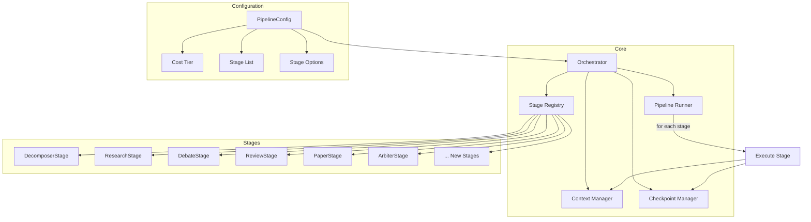

# Design Document: Orchestrator Refactor

## Overview

This refactoring transforms the monolithic orchestrator.py into a modular, stage-based architecture. Each pipeline stage becomes a separate module with a common interface, enabling easy addition of new stages (hierarchical learning, intelligent research, red team) without modifying core orchestrator code.

## Architecture



## Components and Interfaces

### 1. Stage Interface

```python
# backend/orchestrator/stages/base.py
from abc import ABC, abstractmethod
from dataclasses import dataclass
from typing import Any, Dict, Optional, List

@dataclass
class StageResult:
    """Result from a stage execution."""
    success: bool
    output: Dict[str, Any]
    error: Optional[str] = None
    duration_seconds: float = 0.0
    
@dataclass
class StageConfig:
    """Configuration for a stage."""
    enabled: bool = True
    options: Dict[str, Any] = None
    cost_tier: str = "standard"  # quick, standard, thorough

class Stage(ABC):
    """Base class for all pipeline stages."""
    
    name: str  # Unique stage identifier
    description: str
    required_context: List[str]  # Context keys this stage needs
    produces: List[str]  # Context keys this stage produces
    
    def __init__(self, config: StageConfig):
        self.config = config
    
    @abstractmethod
    def run(self, context: 'PipelineContext') -> StageResult:
        """Execute the stage with given context."""
        pass
    
    def validate_context(self, context: 'PipelineContext') -> bool:
        """Check if required context is present."""
        for key in self.required_context:
            if key not in context:
                return False
        return True
    
    def should_skip(self, context: 'PipelineContext') -> bool:
        """Check if stage should be skipped (e.g., already completed)."""
        return not self.config.enabled
```

### 2. Pipeline Context

```python
# backend/orchestrator/context.py
from dataclasses import dataclass, field
from typing import Any, Dict, List, Optional
from datetime import datetime

@dataclass
class PipelineContext:
    """Shared context passed between stages."""
    
    # Input
    components: List[str]
    project_context: str
    
    # Configuration
    cost_tier: str = "standard"
    max_cycles: int = 3
    
    # Runtime state
    current_component: Optional[str] = None
    current_cycle: int = 1
    
    # Stage outputs (populated as stages run)
    data: Dict[str, Any] = field(default_factory=dict)
    
    # Metadata
    run_id: str = ""
    started_at: datetime = None
    
    def __contains__(self, key: str) -> bool:
        return key in self.data
    
    def __getitem__(self, key: str) -> Any:
        return self.data[key]
    
    def __setitem__(self, key: str, value: Any):
        self.data[key] = value
    
    def get(self, key: str, default: Any = None) -> Any:
        return self.data.get(key, default)
    
    def update(self, result: StageResult):
        """Merge stage result into context."""
        self.data.update(result.output)
    
    def to_dict(self) -> Dict[str, Any]:
        """Serialize context for checkpointing."""
        return {
            "components": self.components,
            "project_context": self.project_context,
            "cost_tier": self.cost_tier,
            "current_component": self.current_component,
            "current_cycle": self.current_cycle,
            "data": self.data,
            "run_id": self.run_id,
        }
    
    @classmethod
    def from_dict(cls, d: Dict[str, Any]) -> 'PipelineContext':
        """Deserialize context from checkpoint."""
        ctx = cls(
            components=d["components"],
            project_context=d["project_context"],
            cost_tier=d.get("cost_tier", "standard"),
        )
        ctx.current_component = d.get("current_component")
        ctx.current_cycle = d.get("current_cycle", 1)
        ctx.data = d.get("data", {})
        ctx.run_id = d.get("run_id", "")
        return ctx
```

### 3. Stage Registry

```python
# backend/orchestrator/registry.py
from typing import Dict, Type, List
from .stages.base import Stage

class StageRegistry:
    """Registry of available pipeline stages."""
    
    _stages: Dict[str, Type[Stage]] = {}
    
    @classmethod
    def register(cls, stage_class: Type[Stage]):
        """Register a stage class."""
        cls._stages[stage_class.name] = stage_class
        return stage_class
    
    @classmethod
    def get(cls, name: str) -> Type[Stage]:
        """Get a stage class by name."""
        if name not in cls._stages:
            raise ValueError(f"Unknown stage: {name}")
        return cls._stages[name]
    
    @classmethod
    def list_stages(cls) -> List[str]:
        """List all registered stage names."""
        return list(cls._stages.keys())

# Decorator for easy registration
def register_stage(cls):
    StageRegistry.register(cls)
    return cls
```

### 4. Pipeline Runner

```python
# backend/orchestrator/pipeline.py
from dataclasses import dataclass
from typing import List, Dict, Any, Optional
from .stages.base import Stage, StageConfig, StageResult
from .context import PipelineContext
from .registry import StageRegistry
from .checkpoint import CheckpointManager

@dataclass
class PipelineConfig:
    """Configuration for a pipeline."""
    stages: List[str]
    stage_configs: Dict[str, StageConfig] = None
    cost_tier: str = "standard"
    checkpoint_enabled: bool = True
    parallel_enabled: bool = True
    
    def get_stage_config(self, stage_name: str) -> StageConfig:
        if self.stage_configs and stage_name in self.stage_configs:
            return self.stage_configs[stage_name]
        return StageConfig(cost_tier=self.cost_tier)

class PipelineRunner:
    """Executes a pipeline of stages."""
    
    def __init__(self, config: PipelineConfig):
        self.config = config
        self.checkpoint_mgr = CheckpointManager() if config.checkpoint_enabled else None
        self._stages: List[Stage] = []
        self._build_stages()
    
    def _build_stages(self):
        """Instantiate stages from config."""
        for stage_name in self.config.stages:
            stage_class = StageRegistry.get(stage_name)
            stage_config = self.config.get_stage_config(stage_name)
            self._stages.append(stage_class(stage_config))
    
    def validate(self) -> List[str]:
        """Validate pipeline configuration. Returns list of errors."""
        errors = []
        produced = set()
        
        for stage in self._stages:
            # Check required context is available
            for req in stage.required_context:
                if req not in produced and req not in ["components", "project_context"]:
                    errors.append(f"Stage '{stage.name}' requires '{req}' but no prior stage produces it")
            
            # Track what this stage produces
            produced.update(stage.produces)
        
        return errors
    
    def run(self, context: PipelineContext) -> PipelineContext:
        """Execute all stages in order."""
        for stage in self._stages:
            if stage.should_skip(context):
                print(f"[{stage.name}] Skipped")
                continue
            
            # Check for checkpoint
            if self.checkpoint_mgr:
                cached = self.checkpoint_mgr.load(context.run_id, stage.name)
                if cached:
                    print(f"[{stage.name}] Loaded from checkpoint")
                    context.update(cached)
                    continue
            
            # Validate context
            if not stage.validate_context(context):
                raise ValueError(f"Stage '{stage.name}' missing required context")
            
            # Run stage
            print(f"[{stage.name}] Running...")
            result = stage.run(context)
            
            if not result.success:
                raise RuntimeError(f"Stage '{stage.name}' failed: {result.error}")
            
            # Update context
            context.update(result)
            
            # Save checkpoint
            if self.checkpoint_mgr:
                self.checkpoint_mgr.save(context.run_id, stage.name, result)
            
            print(f"[{stage.name}] Complete ({result.duration_seconds:.1f}s)")
        
        return context
```

### 5. Example Stage Implementation

```python
# backend/orchestrator/stages/decomposer.py
from ..registry import register_stage
from ..context import PipelineContext
from .base import Stage, StageResult, StageConfig
from ...llm_clients import call_llm_json

@register_stage
class DecomposerStage(Stage):
    name = "decomposer"
    description = "Decompose component into subcomponents"
    required_context = ["components", "project_context"]
    produces = ["decomposition", "nodes"]
    
    def run(self, context: PipelineContext) -> StageResult:
        import time
        start = time.time()
        
        component = context.current_component or context.components[0]
        
        result = call_llm_json(
            self._get_backend(),
            self._get_system_prompt(),
            f'Decompose: "{component}"'
        )
        
        # Ensure valid structure
        result.setdefault("root_component", component)
        if "nodes" not in result or not result["nodes"]:
            result["nodes"] = [{
                "name": component,
                "description": "Root component",
                "depth": 0,
                "parent_name": None,
                "should_run_pipeline": True
            }]
        
        return StageResult(
            success=True,
            output={
                "decomposition": result,
                "nodes": result["nodes"]
            },
            duration_seconds=time.time() - start
        )
    
    def _get_backend(self) -> str:
        from ...config import MODEL_ROUTING
        return MODEL_ROUTING.get("decomposer", "openai")
    
    def _get_system_prompt(self) -> str:
        from ...config import PROJECT_CONTEXT
        return PROJECT_CONTEXT + """
You are the COMPONENT DECOMPOSER. Break down a component into subcomponents.
Respond with STRICT JSON: {"root_component": "string", "nodes": [...]}
"""
```

### 6. Main Orchestrator

```python
# backend/orchestrator/core.py
from typing import List, Dict, Any, Optional
from datetime import datetime
import uuid

from .pipeline import PipelineRunner, PipelineConfig
from .context import PipelineContext
from ..config import PROJECT_CONTEXT

# Default pipeline (matches current behavior)
DEFAULT_PIPELINE = [
    "decomposer",
    "research_rounds",
    "debate",
    "reviewers",
    "paper_v1",
    "critics",
    "paper_revision",
    "verification",
    "meta_debate",
    "meta_reviewers",
    "paper_v2",
    "final_arbiter",
]

# Extended pipeline (with new features)
EXTENDED_PIPELINE = [
    "system_survey",        # NEW: Hierarchical learning
    "relationship_mapping", # NEW: Hierarchical learning
    "constraint_propagation", # NEW: Hierarchical learning
    "decomposer",
    "foundation_learning",  # NEW: Intelligent research
    "hypothesis_formation", # NEW: Intelligent research
    "evidence_gathering",   # NEW: Intelligent research
    "research_rounds",
    "debate",
    "reviewers",
    "paper_v1",
    "critics",
    "paper_revision",
    "verification",
    "meta_debate",
    "meta_reviewers",
    "paper_v2",
    "red_team",            # NEW: Red team agent
    "final_arbiter",
]

class Orchestrator:
    """Main orchestrator for research pipelines."""
    
    def __init__(
        self,
        pipeline: List[str] = None,
        cost_tier: str = "standard",
        checkpoint_enabled: bool = True,
    ):
        self.pipeline_config = PipelineConfig(
            stages=pipeline or DEFAULT_PIPELINE,
            cost_tier=cost_tier,
            checkpoint_enabled=checkpoint_enabled,
        )
        self.runner = PipelineRunner(self.pipeline_config)
        
        # Validate pipeline
        errors = self.runner.validate()
        if errors:
            raise ValueError(f"Invalid pipeline: {errors}")
    
    def run(
        self,
        components: List[str],
        project_context: str = None,
    ) -> Dict[str, Any]:
        """Run the research pipeline on given components."""
        
        context = PipelineContext(
            components=components,
            project_context=project_context or PROJECT_CONTEXT,
            cost_tier=self.pipeline_config.cost_tier,
            run_id=str(uuid.uuid4()),
            started_at=datetime.utcnow(),
        )
        
        # Run pipeline
        result_context = self.runner.run(context)
        
        return result_context.to_dict()
```

## Data Models

### Pipeline Configuration

```python
# Example configurations for different use cases

# Quick research (low cost)
QUICK_CONFIG = PipelineConfig(
    stages=["decomposer", "research_rounds", "debate", "paper_v1", "final_arbiter"],
    cost_tier="quick",
)

# Standard research (current behavior)
STANDARD_CONFIG = PipelineConfig(
    stages=DEFAULT_PIPELINE,
    cost_tier="standard",
)

# Thorough research (with all new features)
THOROUGH_CONFIG = PipelineConfig(
    stages=EXTENDED_PIPELINE,
    cost_tier="thorough",
    stage_configs={
        "foundation_learning": StageConfig(options={"rounds": 5}),
        "red_team": StageConfig(options={"intensity": "thorough"}),
    }
)
```

## Correctness Properties

*A property is a characteristic or behavior that should hold true across all valid executions of a system.*

### Property 1: Stage interface compliance
*For any* registered stage, it should implement all required methods of the Stage interface.
**Validates: Requirements 1.1**

### Property 2: Context propagation
*For any* stage execution, the output should be merged into context and available to subsequent stages.
**Validates: Requirements 3.2**

### Property 3: Pipeline validation
*For any* pipeline configuration, validation should detect missing dependencies before execution.
**Validates: Requirements 2.4**

### Property 4: Checkpoint resumption
*For any* interrupted run with checkpoints, resuming should skip completed stages and continue from the last checkpoint.
**Validates: Requirements 4.2, 4.3**

### Property 5: Backward compatibility
*For any* input that worked with the old orchestrator, the refactored version should produce equivalent output.
**Validates: Requirements 6.1, 6.3**

## Error Handling

| Error Scenario | Handling Strategy |
|----------------|-------------------|
| Unknown stage name | Raise ValueError with available stages |
| Missing required context | Raise ValueError with missing keys |
| Stage execution fails | Raise RuntimeError with stage name and error |
| Invalid pipeline (missing deps) | Raise ValueError with dependency errors |
| Checkpoint load fails | Log warning, re-run stage |

## Testing Strategy

### Unit Tests
- Test Stage interface compliance
- Test PipelineContext serialization
- Test StageRegistry operations
- Test PipelineRunner validation

### Property-Based Tests
- Context propagation property
- Pipeline validation property

### Integration Tests
- Run default pipeline, compare to old orchestrator output
- Run with checkpoints, interrupt, resume
- Run with different cost tiers
