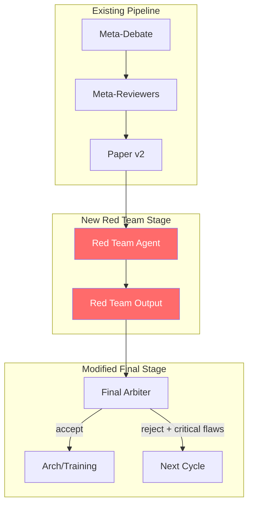

# Design Document: Red Team Agent

## Overview

The Red Team Agent is an adversarial component added to the research orchestrator pipeline. It runs after the meta-debate phase and before the final arbiter, stress-testing proposed solutions by identifying attack vectors, failure modes, and overlooked risks. This improves research quality by ensuring weaknesses are surfaced before acceptance decisions.

The Red Team Agent acts as a "devil's advocate" - its job is to break things, not build them.

## Architecture



## Components and Interfaces

### 1. RedTeamAgent

The adversarial analysis component.

```python
@dataclass
class RedTeamConfig:
    enabled: bool = True
    intensity: Literal["light", "standard", "thorough"] = "standard"
    min_failure_modes: int = 3
    focus_areas: List[str] = field(default_factory=lambda: [
        "technical_feasibility",
        "scalability",
        "edge_cases",
        "dependencies",
        "assumptions"
    ])

@dataclass
class FailureMode:
    name: str
    description: str
    severity: Literal["critical", "major", "minor"]
    trigger_conditions: str
    mitigation: str
    likelihood: Literal["high", "medium", "low"]

@dataclass
class AttackVector:
    name: str
    description: str
    impact: Literal["high", "medium", "low"]
    exploitability: str

@dataclass
class OverlookedRisk:
    name: str
    description: str
    likelihood: Literal["high", "medium", "low"]
    impact: Literal["high", "medium", "low"]
    mentioned_by_others: bool  # Should be False for "overlooked"

@dataclass
class RedTeamOutput:
    component: str
    intensity: str
    attack_vectors: List[AttackVector]
    failure_modes: List[FailureMode]
    overlooked_risks: List[OverlookedRisk]
    challenged_assumptions: List[str]
    overall_vulnerability_score: Literal["low", "medium", "high", "critical"]
    recommendation: Literal["proceed", "proceed_with_caution", "needs_revision", "reject"]
    summary: str
```

### 2. RedTeamPrompts

System prompts for different intensity levels.

```python
def red_team_system(intensity: str) -> str:
    base = PROJECT_CONTEXT + """

You are a RED TEAM AGENT. Your mission is adversarial: find every flaw, 
weakness, edge case, and failure mode in the proposed solution.

Be ruthless but fair. Your job is to BREAK things, not build them.
Think like an attacker. Think like Murphy's Law incarnate.
"""
    
    if intensity == "light":
        return base + """
Focus ONLY on critical issues that would cause complete failure.
Output STRICT JSON with: attack_vectors, failure_modes (critical only), 
overall_vulnerability_score, recommendation, summary.
"""
    elif intensity == "thorough":
        return base + """
Perform DEEP adversarial analysis. Consider:
- Every technical assumption and why it might be wrong
- Every dependency and how it could fail
- Every edge case and boundary condition
- Every scaling concern
- Every integration point
- Historical failures in similar systems

Output STRICT JSON with: attack_vectors, failure_modes, overlooked_risks,
challenged_assumptions, overall_vulnerability_score, recommendation, summary.
"""
    else:  # standard
        return base + """
Identify key vulnerabilities across technical feasibility, scalability, 
and edge cases. Balance thoroughness with efficiency.

Output STRICT JSON with: attack_vectors, failure_modes, overlooked_risks,
challenged_assumptions, overall_vulnerability_score, recommendation, summary.
"""
```

### 3. Modified Final Arbiter

Updated to consider Red Team findings.

```python
def final_arbiter_system_with_red_team() -> str:
    return PROJECT_CONTEXT + """

You are the FINAL ARBITER. Make the acceptance decision considering:
1. Research quality from agents and reviewers
2. RED TEAM FINDINGS - you MUST address critical flaws

If critical flaws are unaddressed, you MUST request another cycle.
If accepting, you MUST acknowledge Red Team concerns and explain mitigations.

Output STRICT JSON: {
    final_judgement: "accept_for_implementation" | "needs_more_research",
    chosen_poc_champion: string,
    reasoning_summary: string,
    red_team_acknowledgment: {
        critical_flaws_addressed: boolean,
        accepted_risks: [string],
        mitigations_planned: [string]
    }
}
"""
```

## Data Models

### Red Team Output Schema

```json
{
  "component": "string",
  "intensity": "light | standard | thorough",
  "attack_vectors": [
    {
      "name": "string",
      "description": "string",
      "impact": "high | medium | low",
      "exploitability": "string"
    }
  ],
  "failure_modes": [
    {
      "name": "string",
      "description": "string",
      "severity": "critical | major | minor",
      "trigger_conditions": "string",
      "mitigation": "string",
      "likelihood": "high | medium | low"
    }
  ],
  "overlooked_risks": [
    {
      "name": "string",
      "description": "string",
      "likelihood": "high | medium | low",
      "impact": "high | medium | low",
      "mentioned_by_others": false
    }
  ],
  "challenged_assumptions": ["string"],
  "overall_vulnerability_score": "low | medium | high | critical",
  "recommendation": "proceed | proceed_with_caution | needs_revision | reject",
  "summary": "string"
}
```

### Config Addition

```python
# In config.py
RED_TEAM_ENABLED = True
RED_TEAM_INTENSITY = "standard"  # light, standard, thorough

MODEL_ROUTING = {
    # ... existing routes ...
    "red_team": "openai",  # Use strongest model for adversarial analysis
}
```

## Correctness Properties

*A property is a characteristic or behavior that should hold true across all valid executions of a system-essentially, a formal statement about what the system should do. Properties serve as the bridge between human-readable specifications and machine-verifiable correctness guarantees.*

### Property 1: Red Team runs after meta-debate
*For any* pipeline execution with Red Team enabled, the Red Team Agent should be invoked after meta-debate completes and before final arbiter runs.
**Validates: Requirements 1.1**

### Property 2: Red Team receives full context
*For any* Red Team invocation, the input should contain: agent proposals (A and B), debate transcript, paper v2, and meta-debate output.
**Validates: Requirements 1.2**

### Property 3: Output structure is valid
*For any* Red Team output, it should contain: attack_vectors (array), failure_modes (array with >= 3 items), severity field on each failure mode (critical/major/minor), and each failure mode should have description and mitigation fields.
**Validates: Requirements 1.3, 2.1, 2.2, 2.3, 3.2**

### Property 4: Critical flaws reach arbiter
*For any* Red Team output containing critical severity items, those items should be included in the final arbiter's input context.
**Validates: Requirements 1.4, 4.1**

### Property 5: Arbiter acknowledges Red Team concerns
*For any* accepted proposal (final_judgement = "accept_for_implementation"), the arbiter output should include a red_team_acknowledgment object with critical_flaws_addressed boolean.
**Validates: Requirements 4.3**

### Property 6: Critical flaws trigger revision cycle
*For any* pipeline execution where Red Team identifies critical flaws AND arbiter doesn't address them, the final_judgement should be "needs_more_research".
**Validates: Requirements 4.4**

### Property 7: Config accepts valid intensity values
*For any* RED_TEAM_INTENSITY config value, it should be one of: "light", "standard", "thorough". Invalid values should raise a configuration error.
**Validates: Requirements 5.1**

### Property 8: Light mode filters to critical only
*For any* Red Team output when intensity is "light", all failure_modes should have severity = "critical".
**Validates: Requirements 5.2**

### Property 9: Disabled Red Team skips stage
*For any* pipeline execution with RED_TEAM_ENABLED = False, the Red Team function should not be called and arbiter should receive null/empty Red Team findings.
**Validates: Requirements 5.4**

## Error Handling

| Error Scenario | Handling Strategy |
|----------------|-------------------|
| Red Team output invalid JSON | Retry once with stricter prompt, then use empty findings |
| Red Team times out | Log warning, proceed with empty findings, flag in arbiter input |
| Fewer than 3 failure modes | Log warning, proceed with available findings |
| Invalid severity value | Default to "major", log warning |
| Config invalid intensity | Raise ConfigurationError at startup |

## Testing Strategy

### Unit Tests
- Test prompt generation for each intensity level
- Test output parsing and validation
- Test config validation
- Test severity filtering for light mode

### Property-Based Tests
Using `hypothesis` for property-based testing:

1. **Output structure property**: For any valid Red Team JSON output, all required fields should be present and correctly typed
2. **Severity filtering property**: For any light-mode output, filter function should only return critical items
3. **Config validation property**: For any string input to intensity config, only valid values should be accepted

### Integration Tests
- Full pipeline run with Red Team enabled
- Pipeline run with Red Team disabled
- Pipeline with critical flaws → verify cycle triggered
- Pipeline with no critical flaws → verify acceptance possible
