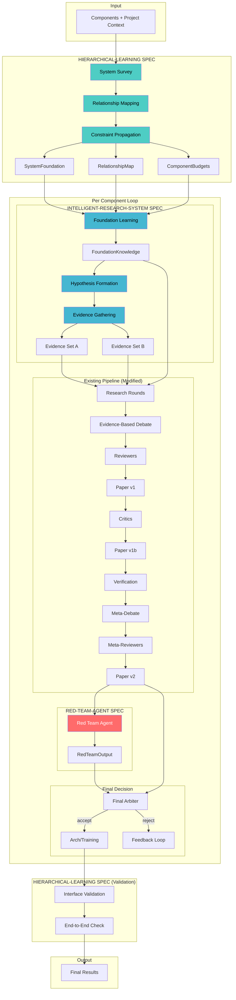

# Design Document: Research Pipeline V2 (Meta-Spec)

## Overview

This meta-spec defines how hierarchical-learning, intelligent-research-system, and red-team-agent integrate into a unified research pipeline. It specifies data flow, integration points, and configuration propagation.

## Architecture



## Integration Points

### 1. Hierarchical → Intelligent Research

```python
# Data passed from hierarchical-learning to intelligent-research-system

@dataclass
class HierarchicalOutput:
    system_foundation: SystemFoundation
    relationship_map: RelationshipMap
    component_budgets: Dict[str, ComponentBudget]
    research_order: List[List[str]]  # Topological sort, grouped by level

# intelligent-research-system receives this as context
class FoundationLearner:
    def learn(
        self,
        component: str,
        hierarchical_context: HierarchicalOutput,  # FROM hierarchical-learning
    ) -> FoundationKnowledge:
        # Use system_foundation for domain context
        # Use relationship_map for interface requirements
        # Use component_budgets for constraints
        pass
```

### 2. Intelligent Research → Research Rounds

```python
# Data passed from intelligent-research-system to research rounds

@dataclass
class IntelligentResearchOutput:
    foundation: FoundationKnowledge
    hypotheses_a: List[Hypothesis]
    hypotheses_b: List[Hypothesis]
    evidence_a: List[Evidence]
    evidence_b: List[Evidence]

# Research rounds receive this as context
class ResearchStage(Stage):
    def run(self, context: PipelineContext) -> StageResult:
        # Get intelligent research output
        ir_output: IntelligentResearchOutput = context["intelligent_research"]
        
        # Agent A uses evidence_a and hypotheses_a
        # Agent B uses evidence_b and hypotheses_b
        # Both have access to foundation knowledge
        pass
```

### 3. Research → Red Team

```python
# Data passed to red-team-agent

@dataclass
class RedTeamInput:
    component: str
    paper_v2: str
    agent_a_research: Dict[str, Any]
    agent_b_research: Dict[str, Any]
    foundation: FoundationKnowledge
    meta_debate: str

# Red team produces
@dataclass
class RedTeamOutput:
    attack_vectors: List[AttackVector]
    failure_modes: List[FailureMode]
    overlooked_risks: List[OverlookedRisk]
    vulnerability_score: str
    recommendation: str
```

### 4. Red Team → Arbiter

```python
# Final arbiter receives red team output

class ArbiterStage(Stage):
    def run(self, context: PipelineContext) -> StageResult:
        red_team: RedTeamOutput = context.get("red_team")
        
        # Arbiter MUST consider red team findings
        # If critical flaws unaddressed, must reject
        
        return StageResult(
            success=True,
            output={
                "final_judgement": "...",
                "red_team_acknowledgment": {
                    "critical_flaws_addressed": True/False,
                    "accepted_risks": [...],
                    "mitigations_planned": [...]
                }
            }
        )
```

## Cost Tier Configuration

```python
@dataclass
class PipelineV2Config:
    cost_tier: Literal["quick", "standard", "thorough"] = "standard"
    
    # Feature toggles
    hierarchical_learning_enabled: bool = True
    intelligent_research_enabled: bool = True
    red_team_enabled: bool = True
    
    # Derived settings based on cost_tier
    @property
    def foundation_rounds(self) -> int:
        return {"quick": 2, "standard": 4, "thorough": 5}[self.cost_tier]
    
    @property
    def evidence_searches_per_agent(self) -> int:
        return {"quick": 3, "standard": 5, "thorough": 8}[self.cost_tier]
    
    @property
    def red_team_intensity(self) -> str:
        return {"quick": "skip", "standard": "light", "thorough": "thorough"}[self.cost_tier]
    
    @property
    def system_survey_depth(self) -> str:
        return {"quick": "minimal", "standard": "standard", "thorough": "comprehensive"}[self.cost_tier]

# Cost estimates per component
COST_ESTIMATES = {
    "quick": {"llm_calls": 15, "searches": 6, "est_cost": 0.50},
    "standard": {"llm_calls": 35, "searches": 15, "est_cost": 1.50},
    "thorough": {"llm_calls": 60, "searches": 25, "est_cost": 3.00},
}
```

## Graceful Degradation

```python
class PipelineV2Runner:
    def run_with_degradation(self, context: PipelineContext) -> PipelineContext:
        degradations = []
        
        # Try hierarchical learning
        if self.config.hierarchical_learning_enabled:
            try:
                context = self.run_hierarchical(context)
            except Exception as e:
                degradations.append(f"Hierarchical learning failed: {e}")
                context["system_foundation"] = None
                context["relationship_map"] = None
        
        # Try intelligent research
        if self.config.intelligent_research_enabled:
            try:
                context = self.run_intelligent_research(context)
            except Exception as e:
                degradations.append(f"Intelligent research failed: {e}")
                # Fall back to simple search
                context = self.run_simple_search(context)
        
        # Run core pipeline (always)
        context = self.run_core_pipeline(context)
        
        # Try red team
        if self.config.red_team_enabled and self.config.red_team_intensity != "skip":
            try:
                context = self.run_red_team(context)
            except Exception as e:
                degradations.append(f"Red team failed: {e}")
                context["red_team"] = None
        
        # Run arbiter (always)
        context = self.run_arbiter(context)
        
        # Log degradations
        if degradations:
            context["degradations"] = degradations
            print(f"[Warning] Pipeline ran with degradations: {degradations}")
        
        return context
```

## Stage Registration

```python
# All stages from all specs registered in one place

# From orchestrator-refactor
from backend.orchestrator.stages import (
    DecomposerStage,
    ResearchStage,
    DebateStage,
    ReviewerStage,
    PaperStage,
    MetaDebateStage,
    ArbiterStage,
)

# From hierarchical-learning
from backend.orchestrator.stages.hierarchical import (
    SystemSurveyStage,
    RelationshipMappingStage,
    ConstraintPropagationStage,
    InterfaceValidationStage,
)

# From intelligent-research-system
from backend.orchestrator.stages.research import (
    FoundationLearningStage,
    HypothesisFormationStage,
    EvidenceGatheringStage,
)

# From red-team-agent
from backend.orchestrator.stages.red_team import (
    RedTeamStage,
)

# Pipeline V2 definition
PIPELINE_V2 = [
    "system_survey",
    "relationship_mapping",
    "constraint_propagation",
    "decomposer",
    "foundation_learning",
    "hypothesis_formation",
    "evidence_gathering",
    "research_rounds",
    "debate",
    "reviewers",
    "paper_v1",
    "critics",
    "paper_revision",
    "verification",
    "meta_debate",
    "meta_reviewers",
    "paper_v2",
    "red_team",
    "final_arbiter",
    "interface_validation",
]
```

## Correctness Properties

*A property is a characteristic or behavior that should hold true across all valid executions of a system.*

### Property 1: Integration order
*For any* pipeline execution, hierarchical-learning stages run before intelligent-research stages, which run before research rounds, and red-team runs before arbiter.
**Validates: Requirements 1.1, 1.2, 1.3**

### Property 2: Data flow completeness
*For any* stage that requires input from a prior spec, that input should be present in the context.
**Validates: Requirements 2.1, 2.2, 2.3, 2.4**

### Property 3: Cost tier propagation
*For any* cost tier setting, all stages should receive and respect the corresponding configuration.
**Validates: Requirements 3.1, 3.2, 3.3, 3.4**

### Property 4: Graceful degradation
*For any* stage failure, the pipeline should continue with degraded functionality and log the issue.
**Validates: Requirements 4.1, 4.2, 4.3, 4.4**

## Testing Strategy

### Integration Tests
- Run full pipeline V2 with all features
- Run with each feature disabled
- Run with each cost tier
- Simulate failures at each integration point
