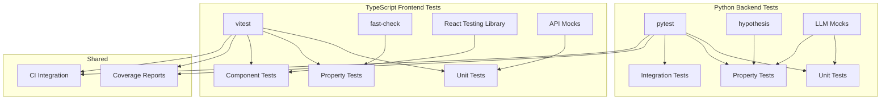

# Design Document: Testing Infrastructure

## Overview

This spec establishes the testing foundation for the entire project. It configures pytest + hypothesis for Python backend testing and vitest + fast-check for TypeScript frontend testing. Critically, it provides LLM mocking utilities so tests can run quickly and deterministically.

## Architecture



## Components and Interfaces

### 1. Python Test Configuration

```python
# pyproject.toml additions
[tool.pytest.ini_options]
testpaths = ["tests"]
python_files = ["test_*.py"]
python_functions = ["test_*"]
addopts = "-v --cov=backend --cov-report=html --cov-report=term"
markers = [
    "unit: Unit tests (fast, no external deps)",
    "property: Property-based tests",
    "integration: Integration tests (may use real LLMs)",
    "slow: Slow tests (skip with -m 'not slow')",
]

[tool.hypothesis]
default_settings = { max_examples = 100, deadline = None }

[tool.coverage.run]
source = ["backend"]
omit = ["tests/*", "*/__pycache__/*"]
```

### 2. Hypothesis Custom Strategies

```python
# tests/strategies.py
from hypothesis import strategies as st
from hypothesis.strategies import composite
from backend.orchestrator.models.foundation import (
    FoundationKnowledge, Concept, VerifiedClaim, OpenQuestion
)

@composite
def concept_strategy(draw):
    return Concept(
        name=draw(st.text(min_size=1, max_size=50)),
        definition=draw(st.text(min_size=10, max_size=200)),
        related_concepts=draw(st.lists(st.text(min_size=1, max_size=30), max_size=5)),
        source_refs=draw(st.lists(st.text(min_size=5, max_size=100), max_size=3))
    )

@composite
def verified_claim_strategy(draw):
    return VerifiedClaim(
        statement=draw(st.text(min_size=10, max_size=200)),
        source_url=draw(st.text(min_size=10, max_size=100)),
        source_quote=draw(st.text(min_size=20, max_size=300)),
        confidence=draw(st.floats(min_value=0.0, max_value=1.0)),
        verified=draw(st.booleans())
    )

@composite
def foundation_knowledge_strategy(draw):
    return FoundationKnowledge(
        component=draw(st.text(min_size=1, max_size=50)),
        explainer=draw(st.text(min_size=100, max_size=1000)),
        concepts=draw(st.lists(concept_strategy(), min_size=1, max_size=10)),
        verified_claims=draw(st.lists(verified_claim_strategy(), max_size=20)),
        open_debates=draw(st.lists(st.text(), max_size=5)),
        open_questions=draw(st.lists(st.text(), max_size=5)),
        confidence_score=draw(st.floats(min_value=0.0, max_value=1.0)),
        sources_used=draw(st.lists(st.dictionaries(st.text(), st.text()), max_size=10))
    )

# Relationship strategies
@composite
def component_relationship_strategy(draw):
    components = ["Signal Processing", "Neural Decoding", "Gaming UI", "Data Storage"]
    source = draw(st.sampled_from(components))
    target = draw(st.sampled_from([c for c in components if c != source]))
    return ComponentRelationship(
        source=source,
        target=target,
        relationship_type=draw(st.sampled_from(["feeds_into", "depends_on", "constrains"])),
        interface=draw(interface_spec_strategy()),
        description=draw(st.text(min_size=10, max_size=100))
    )
```

### 3. LLM Mock System

```python
# tests/mocks/llm_mock.py
import json
from pathlib import Path
from typing import Dict, Any, Optional, Callable
from unittest.mock import MagicMock, patch
import hashlib

class LLMMockRegistry:
    """Registry of mock LLM responses for testing."""
    
    def __init__(self, recordings_dir: Path = Path("tests/fixtures/llm_recordings")):
        self.recordings_dir = recordings_dir
        self.recordings_dir.mkdir(parents=True, exist_ok=True)
        self._responses: Dict[str, Any] = {}
        self._call_log: list = []
    
    def _hash_prompt(self, system: str, user: str) -> str:
        """Create deterministic hash of prompt for lookup."""
        content = f"{system}|||{user}"
        return hashlib.md5(content.encode()).hexdigest()[:16]
    
    def register_response(self, system_prompt: str, user_prompt: str, response: Any):
        """Register a mock response for a specific prompt."""
        key = self._hash_prompt(system_prompt, user_prompt)
        self._responses[key] = response
    
    def get_response(self, system_prompt: str, user_prompt: str) -> Optional[Any]:
        """Get mock response if registered."""
        key = self._hash_prompt(system_prompt, user_prompt)
        self._call_log.append({
            "system": system_prompt[:100],
            "user": user_prompt[:100],
            "key": key
        })
        return self._responses.get(key)
    
    def save_recording(self, name: str):
        """Save current responses to file for replay."""
        path = self.recordings_dir / f"{name}.json"
        path.write_text(json.dumps(self._responses, indent=2))
    
    def load_recording(self, name: str):
        """Load responses from file."""
        path = self.recordings_dir / f"{name}.json"
        if path.exists():
            self._responses = json.loads(path.read_text())


class MockLLMClient:
    """Mock LLM client for testing."""
    
    def __init__(self, registry: LLMMockRegistry, default_response: Callable = None):
        self.registry = registry
        self.default_response = default_response or self._default_json_response
    
    def _default_json_response(self, system: str, user: str) -> str:
        """Generate a plausible default response based on prompt."""
        if "JSON" in system:
            return json.dumps({"mock": True, "prompt_hash": self.registry._hash_prompt(system, user)})
        return f"Mock response for: {user[:50]}..."
    
    def call(self, backend: str, system_prompt: str, user_prompt: str) -> str:
        response = self.registry.get_response(system_prompt, user_prompt)
        if response is not None:
            return response
        return self.default_response(system_prompt, user_prompt)


# Pytest fixtures
import pytest

@pytest.fixture
def llm_mock_registry():
    return LLMMockRegistry()

@pytest.fixture
def mock_llm(llm_mock_registry):
    return MockLLMClient(llm_mock_registry)

@pytest.fixture
def patch_llm_calls(mock_llm):
    """Patch all LLM calls to use mock."""
    with patch('backend.llm_clients.call_llm', mock_llm.call):
        with patch('backend.llm_clients.call_llm_json', 
                   lambda b, s, u: json.loads(mock_llm.call(b, s, u))):
            yield mock_llm
```

### 4. TypeScript Test Configuration

```typescript
// frontend/vitest.config.ts
import { defineConfig } from 'vitest/config';
import react from '@vitejs/plugin-react';

export default defineConfig({
  plugins: [react()],
  test: {
    globals: true,
    environment: 'jsdom',
    setupFiles: ['./src/test/setup.ts'],
    include: ['src/**/*.test.{ts,tsx}'],
    coverage: {
      provider: 'v8',
      reporter: ['text', 'html'],
      include: ['src/**/*.{ts,tsx}'],
      exclude: ['src/test/**', 'src/**/*.test.{ts,tsx}'],
    },
  },
});
```

### 5. Fast-Check Arbitraries

```typescript
// frontend/src/test/arbitraries.ts
import * as fc from 'fast-check';

// Research result arbitrary
export const researchResultArb = fc.record({
  id: fc.uuid(),
  component: fc.string({ minLength: 1, maxLength: 50 }),
  status: fc.constantFrom('pending', 'running', 'completed', 'failed'),
  progress: fc.integer({ min: 0, max: 100 }),
  startedAt: fc.date(),
  completedAt: fc.option(fc.date()),
});

// Foundation knowledge arbitrary
export const foundationKnowledgeArb = fc.record({
  component: fc.string({ minLength: 1, maxLength: 50 }),
  explainer: fc.string({ minLength: 100, maxLength: 1000 }),
  concepts: fc.array(fc.record({
    name: fc.string({ minLength: 1, maxLength: 50 }),
    definition: fc.string({ minLength: 10, maxLength: 200 }),
  }), { minLength: 1, maxLength: 10 }),
  confidenceScore: fc.float({ min: 0, max: 1 }),
});

// API response arbitrary
export const apiResponseArb = <T>(dataArb: fc.Arbitrary<T>) => 
  fc.record({
    success: fc.boolean(),
    data: fc.option(dataArb),
    error: fc.option(fc.string()),
  });
```

### 6. API Mock Utilities

```typescript
// frontend/src/test/api-mocks.ts
import { vi } from 'vitest';

export const createApiMock = () => {
  const mockFetch = vi.fn();
  
  return {
    mockFetch,
    
    mockSuccess: <T>(data: T) => {
      mockFetch.mockResolvedValueOnce({
        ok: true,
        json: () => Promise.resolve({ success: true, data }),
      });
    },
    
    mockError: (message: string, status = 500) => {
      mockFetch.mockResolvedValueOnce({
        ok: false,
        status,
        json: () => Promise.resolve({ success: false, error: message }),
      });
    },
    
    mockWebSocket: () => {
      const listeners: Record<string, Function[]> = {};
      return {
        addEventListener: (event: string, cb: Function) => {
          listeners[event] = listeners[event] || [];
          listeners[event].push(cb);
        },
        send: vi.fn(),
        close: vi.fn(),
        emit: (event: string, data: any) => {
          listeners[event]?.forEach(cb => cb({ data: JSON.stringify(data) }));
        },
      };
    },
  };
};
```

## Directory Structure

```
tests/                          # Python tests
├── conftest.py                 # Shared fixtures
├── strategies.py               # Hypothesis strategies
├── mocks/
│   ├── __init__.py
│   ├── llm_mock.py            # LLM mocking utilities
│   └── search_mock.py         # Search API mocks
├── fixtures/
│   ├── llm_recordings/        # Recorded LLM responses
│   └── sample_data/           # Sample test data
├── unit/
│   ├── test_foundation.py
│   ├── test_hypothesis_formation.py
│   └── ...
├── property/
│   ├── test_foundation_props.py
│   ├── test_constraint_props.py
│   └── ...
└── integration/
    ├── test_pipeline.py
    └── test_full_research.py

frontend/src/test/              # TypeScript tests
├── setup.ts                    # Test setup
├── arbitraries.ts              # fast-check arbitraries
├── api-mocks.ts                # API mocking utilities
└── test-utils.tsx              # React testing utilities
```

## Correctness Properties

*A property is a characteristic or behavior that should hold true across all valid executions of a system.*

### Property 1: Mock registry determinism
*For any* prompt pair (system, user), the same hash should always be generated, ensuring deterministic mock lookups.
**Validates: Requirements 5.1**

### Property 2: Strategy generates valid objects
*For any* object generated by a hypothesis strategy, it should pass the corresponding dataclass validation.
**Validates: Requirements 2.2**

### Property 3: Test discovery finds all tests
*For any* test file matching the pattern, pytest/vitest should discover and include it in the test run.
**Validates: Requirements 1.1, 3.1**

## Error Handling

| Error Scenario | Handling Strategy |
|----------------|-------------------|
| No mock registered for prompt | Use default response generator, log warning |
| Strategy generates invalid data | Fix strategy constraints, fail test clearly |
| Coverage below threshold | Fail CI, report uncovered lines |
| Integration test timeout | Set reasonable timeout, skip in CI if needed |

## Testing Strategy

This is meta - testing the testing infrastructure:

### Unit Tests
- Test mock registry hash consistency
- Test strategy output validity
- Test API mock behavior

### Integration Tests
- Run sample tests to verify framework setup
- Verify coverage reporting works
